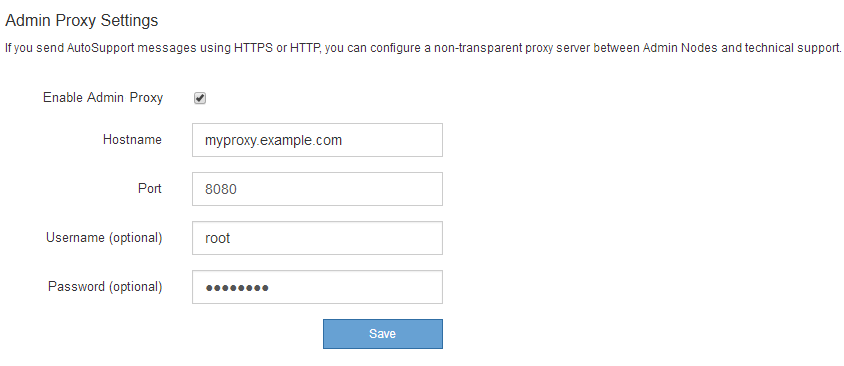

= 設定管理Proxy設定
:allow-uri-read: 
:icons: font
:imagesdir: ../media/

[role="lead"]
如果您使用AutoSupport HTTP或HTTPS傳送不實訊息（請參閱 link:configure-autosupport-grid-manager.html["設定AutoSupport 功能"]）、您可以在管理節點和技術支援AutoSupport （例如、）之間設定不透明的Proxy伺服器。

.開始之前
* 您擁有特定的存取權限。
* 您將使用登入Grid Manager link:../admin/web-browser-requirements.html["支援的網頁瀏覽器"]。

.關於這項工作
您可以設定單一管理Proxy的設定。

.步驟
. 選擇*組態*>*安全性*>* Proxy設定*。
+
此時會出現「管理Proxy設定」頁面。預設會在側邊列功能表中選取* Storage *。

. 從側欄功能表中、選取*管理*。
+
image::../media/proxy_settings_menu_admin.png[Proxy設定功能表-管理]

. 選中 *Enable Admin Proxy* 複選框。
+

. 輸入Proxy伺服器的主機名稱或IP位址。
. 輸入用來連線至Proxy伺服器的連接埠。
. 或者、輸入Proxy使用者名稱。
+
如果您的Proxy伺服器不需要使用者名稱、請將此欄位留白。

. 或者、輸入Proxy密碼。
+
如果您的Proxy伺服器不需要密碼、請將此欄位留白。

. 選擇*保存*。
+
儲存管理Proxy之後、系統會設定管理節點與技術支援之間的Proxy伺服器。

+

NOTE: Proxy變更可能需要10分鐘才能生效。

. 如果需要禁用代理，請清除 *Enable Admin Proxy* 複選框，然後選擇 *Save* 。

