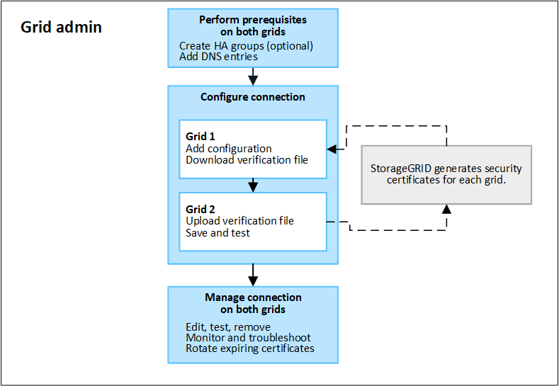

= Grid Federation 工作流程
:allow-uri-read: 
:icons: font
:imagesdir: ../media/

[role="lead"]
身為網格管理員、您必須與租戶使用者密切協調、以建立並使用兩個 StorageGRID 系統之間的網格同盟連線、進行帳戶複製和跨網格複寫。

工作流程圖顯示網格管理員和租戶使用者在兩個網格之間建立網格同盟連線、以及設定帳戶複製和跨網格複寫所需執行的高階步驟。

在兩個網格之間建立網格同盟連線之後、網格管理員會建立一個或多個新的租戶帳戶、並指派權限來判斷誰可以使用該連線。儲存新租用戶時、 StorageGRID 會自動在其他網格上建立相同的租用戶。

在兩個網格上都有新的租戶之後、租戶使用者可以執行下列作業：

* 從租戶的來源網格建立新的租戶使用者和群組、這些使用者和群組會自動複製到租戶的目的地網格。
* 從租戶的來源網格建立新的 S3 存取金鑰、可選擇性地複製到租戶的目的地網格。
* 在兩個網格上建立新的儲存格、並選擇性地在單一方向或雙向啟用跨網格複寫。

