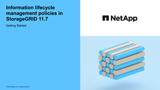

= 建立建議的ILM原則
:allow-uri-read: 
:icons: font
:imagesdir: ../media/

[role="lead"]
您可以從頭開始建立建議的ILM原則、或是想要從相同的規則集開始複製目前的作用中原則。

在建立自己的原則之前、請先確認 link:creating-ilm-policy.html#default-ilm-policy["預設 ILM 原則"] 不符合您的儲存需求。

NOTE: 如果是 link:enabling-s3-object-lock-globally.html["全域 S3 物件鎖定設定已啟用"]、您必須確保 ILM 原則符合已啟用 S3 物件鎖定的儲存區需求。在本節中、請遵循已啟用 S3 物件鎖定的指示。

.開始之前
* 您將使用登入Grid Manager link:../admin/web-browser-requirements.html["支援的網頁瀏覽器"]。
* 您擁有 link:../admin/admin-group-permissions.html["必要的存取權限"]。
* 您有 link:access-create-ilm-rule-wizard.html["已建立 ILM 規則"] 根據是否啟用 S3 物件鎖定。

[role="tabbed-block"]
====
.S3 物件鎖定未啟用
--
* 您有 link:what-ilm-rule-is.html["已建立 ILM 規則"] 您想要新增至建議的原則。視需要、您可以儲存建議的原則、建立其他規則、然後編輯建議的原則以新增規則。
* 您有 link:creating-default-ilm-rule.html["已建立預設ILM規則"] 不包含任何篩選條件。

--
.S3 物件鎖定已啟用
--
* 。 link:enabling-s3-object-lock-globally.html["全域 S3 物件鎖定設定已啟用"] 適用於 StorageGRID 系統。
* 您有 link:what-ilm-rule-is.html["已建立相容且不符合法規的 ILM 規則"] 您想要新增至建議的原則。視需要、您可以儲存建議的原則、建立其他規則、然後編輯建議的原則以新增規則。
* 您有 link:creating-default-ilm-rule.html["已建立預設ILM規則"] 符合法規的原則。

--
====
* 您也可以選擇觀看影片： https://netapp.hosted.panopto.com/Panopto/Pages/Viewer.aspx?id=0009ebe1-3665-4cdc-a101-afbd009a0466["影片： StorageGRID 11.7 中的資訊生命週期管理原則"^]
+
[link=https://netapp.hosted.panopto.com/Panopto/Pages/Viewer.aspx?id=0009ebe1-3665-4cdc-a101-afbd009a0466]

另請參閱 link:creating-ilm-policy.html["建立 ILM 原則：概述"]。

.關於這項工作
建立建議ILM原則的典型理由包括：

* 您新增了一個新站台、需要使用新的ILM規則將物件放置在該站台。
* 您正在汰換站台、需要移除所有參照該站台的 ILM 規則。
* 您新增了具有特殊資料保護需求的新租戶。
* 您開始使用雲端儲存資源池。

IMPORTANT: 只能在測試系統中使用系統提供的原則「基準 2 複本」原則。對於 StorageGRID 11.6 及更早版本、此原則中的預設規則會使用「所有儲存節點」儲存池、其中包含所有站台。如果StorageGRID 您的作業系統有多個站台、則一個物件的兩份複本可能會放在同一個站台上。

.步驟
. 選擇* ILM *>* Policies *。
+
如果啟用全域 S3 物件鎖定設定、則「 ILM 原則」頁面會指出哪些 ILM 規則符合規定。

. 判斷您要如何建立建議的ILM原則。+

[role="tabbed-block"]
====
.從頭開始
--
. 如果目前存在建議的 ILM 原則、請選取 * 建議的原則 * > * 動作 * > * 移除 * 。
+
如果建議的原則已經存在、您就無法建立新的建議原則。

. 選取 * 建立建議原則 * > * 建立新原則 * 。

--
.從使用中原則的規則開始
--
. 如果目前存在建議的 ILM 原則、請選取 * 建議的原則 * > * 動作 * > * 移除 * 。
+
如果建議的原則已經存在、則無法複製作用中原則。

. 選取 * 建立建議原則 * > * 複製作用中原則 * 。

--
.編輯現有的建議原則
. 選擇 * 建議政策 * > * 行動 * > * 編輯 * 。

====
. 在 * 建議原則名稱 * 欄位中、輸入建議原則的唯一名稱。
. 在 * 變更理由 * 欄位中、輸入您建立新建議原則的理由。
. 若要將規則新增至原則、請選取 * 選取規則 * 。選取規則名稱以檢視該規則的設定。
+

NOTE: 系統會定期自動更新規則清單、以反映新增或移除的情況。如果在您選取規則之後移除該規則、就會出現錯誤訊息。

+
如果您要複製原則：

+
** 您正在複製的原則所使用的規則會被選取。
** 如果您正在複製的原則使用的任何規則都沒有非預設規則的篩選器、系統會提示您移除其中一個規則以外的所有規則。
** 如果預設規則使用篩選器、系統會提示您選取新的預設規則。
** 如果預設規則不是最後一個規則、您可以將規則移至新原則的結尾。

[role="tabbed-block"]
====
.S3 物件鎖定未啟用
--
. 為建議的原則選取一個預設規則。若要建立新的預設規則、請選取 * ILM 規則頁面 * image:../media/icon_nms_more_details.gif["更多詳細資料圖示"]。
+
預設規則會套用至任何不符合原則中其他規則的物件。預設規則無法使用任何篩選條件、而且一律是最後評估的。

+

IMPORTANT: 請勿使用「製作 2 份複本」規則做為原則的預設規則。「製作2份複本」規則使用單一儲存資源池「所有儲存節點」、其中包含所有站台。如果StorageGRID 您的作業系統有多個站台、則一個物件的兩份複本可能會放在同一個站台上。

--
.S3 物件鎖定已啟用
--
. 為建議的原則選取一個預設規則。若要建立新的預設規則、請選取 * ILM 規則頁面 * image:../media/icon_nms_more_details.gif["更多詳細資料圖示"]。
+
規則清單僅包含符合規定且不使用任何篩選器的規則。

+

IMPORTANT: 請勿使用「製作 2 份複本」規則做為原則的預設規則。「製作2份複本」規則使用單一儲存資源池「所有儲存節點」、其中包含所有站台。如果您使用此規則、一個物件的多個複本可能會放置在同一個站台上。

. 如果您在不符合標準的 S3 儲存區中的物件需要不同的「預設」規則、請選取 * 包含不含不符合標準 S3 儲存區篩選器的規則 * 、然後選取一個不符合標準的規則、而不使用篩選器。
+
例如、您可能想要使用雲端儲存池、將物件儲存在未啟用 S3 物件鎖定的儲存區中。

+

NOTE: 您只能選取一個不符合規定的規則、而不使用篩選器。

另請參閱 link:example-7-compliant-ilm-policy-for-s3-object-lock.html["範例7：S3物件鎖定的符合ILM原則"]。

--
====
. 完成選取預設規則後、請選取 * 繼續 * 。
. 針對「其他規則」步驟、選取您要新增至原則的任何其他規則。這些規則至少使用一個篩選器（租戶帳戶、貯體名稱、進階篩選器或非目前參考時間）。然後選擇 * 選擇 * 。
+
「建立建議的原則」視窗現在會列出您選取的規則。預設規則結尾為、其上方則為其他規則。

+
如果啟用 S3 物件鎖定、而且您也選取了不相容的「預設」規則、則該規則會新增為原則中的第二對最後一條規則。

+

NOTE: 如果有任何規則無法永遠保留物件、則會出現警告。當您啟動此原則時、必須確認在預設規則的放置指示到期時、您希望 StorageGRID 刪除物件（除非貯體生命週期將物件保留較長的時間）。

. 拖曳非預設規則的列、以決定評估這些規則的順序。
+
您無法移動預設規則。如果啟用 S3 物件鎖定、如果選取了不相容的「預設」規則、您也無法移動該規則。

+

IMPORTANT: 您必須確認ILM規則的順序正確。當原則啟動時、新物件和現有物件會依照列出的順序進行評估、從上方開始。

. 視需要選取 * 選取規則 * 以新增或移除規則。
. 完成後、請選取*「Save（儲存）」*。
. 前往 link:simulating-ilm-policy.html["模擬ILM原則"]。您應該一律先模擬建議的原則、然後再啟動原則、以確保其正常運作。

