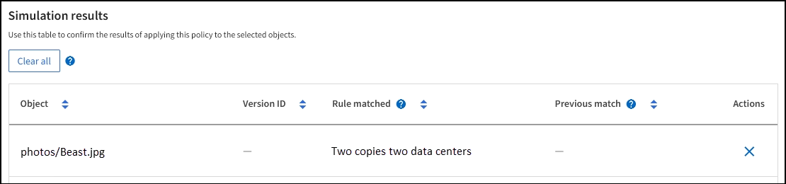

= 模擬ILM原則
:allow-uri-read: 
:icons: font
:imagesdir: ../media/

[role="lead"]
在啟動原則並將原則套用至正式作業資料之前、請先模擬測試物件的建議原則。模擬視窗提供獨立式環境、可在原則啟動並套用至正式作業環境中的資料之前、安全地進行測試。

.開始之前
* 您將使用登入Grid Manager link:../admin/web-browser-requirements.html["支援的網頁瀏覽器"]。
* 您擁有 link:../admin/admin-group-permissions.html["必要的存取權限"]。
* 您知道要測試的每個物件的 S3 貯體 / 物件金鑰或 Swift 容器 / 物件名稱。

.關於這項工作
請仔細選取您想要建議原則測試的物件。若要徹底模擬原則、您應該針對每個規則中的每個篩選器測試至少一個物件。

例如、如果原則包含一個規則來比對儲存區A中的物件、以及另一個規則來比對儲存區B中的物件、則您必須從儲存區A選取至少一個物件、然後從儲存區B選取一個物件、才能徹底測試原則。您也必須從另一個儲存區選取至少一個物件、以測試預設規則。

模擬原則時、請考量下列事項：

* 變更原則之後、請儲存建議的原則。然後、模擬已儲存的建議原則行為。
* 當您模擬原則時、原則中的ILM規則會篩選測試物件、讓您可以查看套用到每個物件的規則。不過、不會建立物件複本、也不會放置任何物件。執行模擬並不會以任何方式修改資料、規則或原則。
* 「模擬建議的原則」視窗會保留您測試的物件、直到您選取 * 全部清除 * 或移除圖示為止 image:../media/icon-x-to-remove.png["移除圖示"] 模擬結果清單中的每個物件。
* Simulation會傳回相符規則的名稱。若要判斷哪個儲存池或銷毀編碼設定檔有效、請選取規則名稱、前往規則詳細資料頁面、在頁面中檢視保留圖表及其他規則詳細資料。
* 如果啟用 S3 版本設定、您可以輸入要用於模擬之物件版本的版本 ID 。

.步驟
. link:creating-proposed-ilm-policy.html["建立建議的原則"]。
. 使用S3或Swift用戶端或 link:../tenant/use-s3-console.html["S3主控台處於實驗階段"]（可在租戶管理程式中針對每個租戶使用）、擷取測試每個規則所需的物件。
. 在「 ILM 原則」頁面上的「建議原則」索引標籤上、選取 * 模擬 * 。
. 在 * 物件 * 欄位中、輸入 S3 `bucket/object-key` 或是 Swift `container/object-name` 用於測試物件。例如、 `bucket-01/filename.png`。
. （可選）在 * 版本 ID* 字段中輸入對象的版本 ID 。
. 選擇*模擬*。
. 在 Simulation 結果區段中、確認每個物件都符合正確的規則。

== 範例1：模擬提議的ILM原則時、請驗證規則

此範例說明如何在模擬建議的原則時驗證規則。

在此範例中、針對兩個儲存區中擷取的物件來模擬*範例ILM原則*。此原則包含三項規則、如下所示：

* 第一條規則*兩份複本（2年、2年用於Bucke-A*）僅適用於Bucke-a中的物件
* 第二條規則* EC物件> 1 MB*、適用於所有儲存區、但會篩選大於1 MB的物件。
* 第三項規則是*兩份複本、兩個資料中心*、這是預設規則。它不包含任何篩選器、也不使用非目前的參考時間。

模擬原則之後、請確認每個物件都符合正確的規則。

image::../media/simulate_policy_screen.png[模擬原則結果]

在此範例中：

* `bucket-a/bucket-a object.pdf` 正確符合第一個規則、該規則會篩選中的物件 `bucket-a`。
* `bucket-b/test object greater than 1 MB.pdf` 在中 `bucket-b`因此不符合第一條規則。相反地、第二個規則會正確比對此規則、該規則會篩選大於1 MB的物件。
* `bucket-b/test object less than 1 MB.pdf` 不符合前兩個規則中的篩選條件、因此會依預設規則放置、而不含篩選條件。

== 範例2：模擬提議的ILM原則時重新排序規則

此範例說明如何在模擬原則時重新排序規則、以變更結果。

在此範例中、*示範*原則正在模擬中。此原則旨在尋找具有series=x-men使用者中繼資料的物件、其中包含三項規則、如下所示：

* 第一條規則* PNG*會篩選以結束的金鑰名稱 `.png`。
* 第二個規則* X-men *僅適用於租戶A的物件和篩選器 `series=x-men` 使用者中繼資料：
* 最後一個規則 * 兩個複本兩個資料中心 * 是預設規則、它會比對任何不符合前兩個規則的物件。

.步驟
. 新增規則並儲存原則之後、請選取*模擬*。
. 在「*物件*」欄位中、輸入測試物件的S3儲存區/物件金鑰或Swift容器/物件名稱、然後選取*模擬*。
+
Simulation 結果隨即出現 , 顯示 `Havok.png` 物件已與* PNG*規則相符。

+
image::../media/simulate_reorder_rules_pngs_result.png[範例2：模擬提議的ILM原則時重新排序規則]

+
不過、 `Havok.png` 旨在測試 *X-men * 規則。

. 若要解決此問題、請重新排序規則。
+
.. 選取 * 完成 * 以關閉「模擬 ILM 原則」視窗。
.. 選取 * 動作 * > * 編輯 * 以編輯原則。
.. 將* X-men *規則拖曳到清單頂端。
.. 選擇*保存*。

. 選擇*模擬*。
+
您先前測試的物件會根據更新的原則重新評估、並顯示新的模擬結果。在範例中、「符合規則」欄會顯示 `Havok.png` 物件現在符合X-men中繼資料規則、如預期。上一匹配列顯示 PNGs 規則與上一模擬中的對象匹配。

+
image::../media/simulate_reorder_rules_correct_result.png[範例2：模擬提議的ILM原則時重新排序規則]

+

NOTE: 如果您停留在「建議的原則」索引標籤上、則可以在進行變更後重新模擬原則、而不需要重新輸入測試物件的名稱。

== 範例3：模擬提議的ILM原則時、請修正規則

此範例說明如何模擬原則、修正原則中的規則、以及繼續模擬。

在此範例中、*示範*原則正在模擬中。此原則旨在尋找擁有的物件 `series=x-men` 使用者中繼資料：但是、針對模擬此原則時、卻發生非預期的結果 `Beast.jpg` 物件：物件不符合X-men中繼資料規則、而是符合預設規則、兩個複本複製兩個資料中心。

當測試物件與原則中的預期規則不符時、您必須檢查原則中的每個規則、並修正任何錯誤。

.步驟
. 選擇 * 完成 * 以關閉模擬原則對話方塊。在 [ 建議原則 ] 索引標籤上，選取 * 保留圖表 * 。然後根據需要爲每個規則選擇 * 展開全部 * 或 * 查看詳細信息 * 。
. 檢閱規則的租戶帳戶、參考時間及篩選條件。
+
例如、假設輸入 X-men 規則的中繼資料為「 'x-men01 」、而非「 'x-men 」。

. 若要解決錯誤、請依照下列步驟修正規則：
+
** 如果規則是建議原則的一部分、您可以複製規則、或是從原則中移除規則、然後加以編輯。
** 如果規則是作用中原則的一部分、則必須複製規則。您無法編輯或移除作用中原則的規則。
+
[cols="1a,3a"]
|===
| 選項 | 步驟 

 a| 
複製規則
 a| 
... 選擇* ILM *>* Rules *。
... 選取不正確的規則、然後選取* Clone（複製）*。
... 輸入新規則的名稱、然後變更不正確的資訊、並選取 * 建立 * 。
... 選擇 * ILM * > * 原則 * > * 建議的原則 * 。
... 選取 * 動作 * > * 編輯 * 。
... 選擇 * 選擇規則 * 、然後選擇 * 繼續 * 以接受相同的預設規則。
... 在「選取其他規則」步驟中、選取新規則的核取方塊、清除原始規則的核取方塊、然後選取 * 選取 * 。
... 如有必要、請將新規則拖曳至正確位置、以重新排序規則。
... 選擇*保存*。

 a| 
編輯規則
 a| 
... 選取 * ILM * > * 原則 * > * 建議的原則 * 、然後移除您要編輯的規則。
... 選擇* ILM *>* Rules *。
... 選取您要編輯的規則、然後選取 * 編輯 * 。或選取規則的核取方塊、然後選取 * 動作 * > * 編輯 * 。
... 變更精靈每個部分的不正確資訊、然後選取 * 更新 * 。
... 選擇 * ILM * > * 原則 * > * 建議的原則 * 。
... 選取 * 動作 * > * 編輯 * 。
... 選擇 * 選擇規則 * 、然後選擇 * 繼續 * 以接受相同的預設規則。
... 在 Select other rules （選擇其他規則）對話框中，選中更正規則的複選框，選擇 *Select* （選擇 * ），然後選擇 *Save* （保存 * ）。
... 拖曳非預設規則的列、以決定評估這些規則的順序。

|===

. 再次執行模擬。
+
在此範例中、修正後的X-men規則現在會符合 `Beast.jpg` 物件基礎 `series=x-men` 使用者中繼資料、如預期。

+
image::../media/simulate_results_for_object_corrected_metadata.png[範例3：模擬提議的ILM原則時修正規則]

