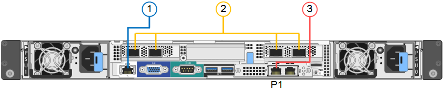

= 纜線應用裝置（SG100和SG1000）
:allow-uri-read: 
:icons: font
:imagesdir: ../media/

[role="lead"]
您必須將應用裝置上的管理連接埠連接至服務筆記型電腦、並將應用裝置上的網路連接埠連接至Grid Network和選用的Client Network for StorageGRID the Sun。

.開始之前
* 您有一條RJ-45乙太網路纜線可用來連接管理連接埠。
* 您有下列其中一個網路連接埠選項。本產品並未隨附這些項目。
+
** 一至四條雙軸纜線、用於連接四個網路連接埠。
** 對於SG100、如果您計畫使用光纖纜線連接埠、則可使用一至四個SFP+或SFP28收發器。
** 對於SG1000、如果您打算使用光纖纜線連接埠、則可使用一至四個QSFP+或QSFP28收發器。

CAUTION: * 暴露於雷射輻射的風險 * - 請勿拆解或移除 SFP 或 QSFP 收發器的任何部分。您可能會暴露在雷射輻射下。

.關於這項工作
下圖顯示設備背面的連接埠。

SG100 連接埠連線：

SG1000 連接埠連線：

image::../media/sg1000_connections.png[SG1000連接埠連線]

[cols="1a,2a,2a,3a"]
|===
| 標註 | 連接埠 | 連接埠類型 | 使用 

 a| 
1.
 a| 
設備上的BMC管理連接埠
 a| 
1-GbE（RJ-45）
 a| 
連線至您存取BMC介面的網路。

 a| 
2.
 a| 
設備上有四個網路連接埠
 a| 
* SG100：10/25-GbE
* SG1000：10/25/40/100-GbE

 a| 
連線到Grid Network和Client Network for StorageGRID the

 a| 
3.
 a| 
應用裝置上的管理網路連接埠（圖中標示為 P1 ）
 a| 
1-GbE（RJ-45）

*重要事項：*此連接埠僅以1000 BaseT/完整運作、不支援10或100 MB的速度。
 a| 
將應用裝置連接至管理網路StorageGRID 以供其使用。

 a| 
 a| 
設備上最適當的RJ-45連接埠
 a| 
1-GbE（RJ-45）

*重要事項：*此連接埠僅以1000 BaseT/完整運作、不支援10或100 MB的速度。
 a| 
* 如果您想要與管理網路建立備援連線、可以與管理連接埠1連結。
* 可保持中斷連線、並可用於暫用本機存取（IP 169.254.0.1）。
* 在安裝期間、如果 DHCP 指派的 IP 位址無法使用、則可用於將應用裝置連線至服務筆記型電腦。

|===
.步驟
. 使用乙太網路纜線、將應用裝置上的BMC管理連接埠連接至管理網路。
+
雖然此連線是選用的、但建議您協助支援。

. 使用雙軸纜線或光纖纜線和收發器、將設備上的網路連接埠連接至適當的網路交換器。
+
[NOTE]
====
所有四個網路連接埠都必須使用相同的連結速度。請參閱下表、瞭解硬體和連結速度所需的設備。

[cols="2a,2a"]
|===
| SG100連結速度（GbE） | 必要設備 

 a| 
10.
 a| 
SFP+收發器

 a| 
25
 a| 
SFP28收發器

| SG1000連結速度（GbE） | 必要設備 

 a| 
10.
 a| 
QSA和SFP+收發器

 a| 
25
 a| 
QSA和SFP28收發器

 a| 
40
 a| 
QSFP+收發器

 a| 
100
 a| 
QFSP28收發器

|===
====
+
** 如果您計畫使用固定連接埠連結模式（預設）、請將連接埠連接StorageGRID 至表格所示的「資訊網」和「用戶端網路」。
+
[cols="1a,2a"]
|===
| 連接埠 | 連線至... 

 a| 
連接埠1
 a| 
用戶端網路（選用）

 a| 
連接埠2
 a| 
網格網路

 a| 
連接埠3
 a| 
用戶端網路（選用）

 a| 
連接埠4.
 a| 
網格網路

|===
** 如果您打算使用Aggregate連接埠連結模式、請將一個或多個網路連接埠連接至一或多個交換器。您應該至少連接四個連接埠中的兩個、以避免單點故障。如果將多個交換器用於單一LACP連結、則交換器必須支援MLAG或等效的交換器。

. 如果您打算使用管理網路StorageGRID 來執行效能、請使用乙太網路纜線、將應用裝置上的管理網路連接埠連接至管理網路。

