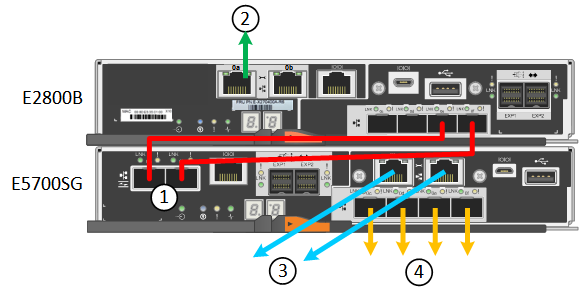

= 纜線應用裝置（SG5700）
:allow-uri-read: 
:icons: font
:imagesdir: ../media/

[role="lead"]
您可以將兩個控制器彼此連接、連接每個控制器上的管理連接埠、並將 E5700SG 控制器上的 10/25-GbE 連接埠連接至 Grid Network 和選用的 Client Network for StorageGRID 。

.開始之前
* 您已解壓縮產品隨附的下列項目：
+
** 兩條電源線。
** 兩條光纖纜線用於控制器上的FC互連連接埠。
** 八個SFP+收發器、支援10-GbE或16-Gbps FC。這些收發器可與兩個控制器上的兩個互連連接埠搭配使用、並可與E5700SG控制器上的四個10/25-GbE網路連接埠搭配使用、前提是您希望網路連接埠使用10-GbE連結速度。

* 您已取得產品未隨附的下列項目：
+
** 一到四條光纖纜線、適用於您打算使用的10/25-GbE連接埠。
** 一到四個SFP28收發器、如果您打算使用25-GbE連結速度。
** 用於連接管理連接埠的乙太網路纜線。

CAUTION: * 暴露於雷射輻射的風險 * - 請勿拆解或移除 SFP 收發器的任何部分。您可能會暴露在雷射輻射下。

.關於這項工作
圖中顯示SG5760和SG5760X中的兩個控制器、E2800系列儲存控制器位於頂端、E5700SG控制器位於底部。在SG5712和SG5712X中、從背面檢視E5700SG控制器時、E2800系列儲存控制器位於E5700SG控制器左側。

SG5760 連線：

image::../media/sg5760_connections.gif[連接SG5760應用裝置]

SG5760X 連線：

[cols="1a,2a,2a,2a"]
|===
| 標註 | 連接埠 | 連接埠類型 | 使用 

 a| 
1.
 a| 
每個控制器上有兩個互連連接埠
 a| 
16Gb/s FC光纖SFP+
 a| 
將兩個控制器彼此連接。

 a| 
2.
 a| 
E2800系列控制器上的管理連接埠1
 a| 
1-GbE（RJ-45）
 a| 
連線至您存取SANtricity 《系統管理程式》的網路。您可以將管理網路用於StorageGRID 不受影響的管理網路、或是獨立的管理網路。

 a| 
2.
 a| 
E2800系列控制器上的管理連接埠2
 a| 
1-GbE（RJ-45）
 a| 
保留以供技術支援使用。

 a| 
3.
 a| 
E5700SG控制器上的管理連接埠1
 a| 
1-GbE（RJ-45）
 a| 
將E5700SG控制器連線至管理網路以供StorageGRID 執行。

 a| 
3.
 a| 
E5700SG控制器上的管理連接埠2
 a| 
1-GbE（RJ-45）
 a| 
* 如果您想要與管理網路建立備援連線、可以與管理連接埠1連結。
* 可保持無線連線、並可用於暫用本機存取（IP 169.254.0.1）。
* 在安裝期間、如果無法使用 DHCP 指派的 IP 位址、則可用來將 E5700SG 控制器連線至服務筆記型電腦。

 a| 
4.
 a| 
E5700SG控制器上的10/25-GbE連接埠1-4
 a| 
10-GbE或25-GbE

*附註：*隨附於應用裝置的SFP+收發器支援10-GbE連結速度。如果您想要在四個網路連接埠使用25-GbE連結速度、則必須提供SFP28收發器。
 a| 
連線到Grid Network和Client Network for StorageGRID the請參閱 link:port-bond-modes-for-e5700sg-controller-ports.html["連接埠連結模式（ E5700SG 控制器）"]。

|===
.步驟
. 使用兩條光纖纜線和八個SFP+收發器中的四條、將E2800控制器連接至E5700SG控制器。
+
[cols="1a,1a"]
|===
| 連接此連接埠... | 至此連接埠... 

 a| 
互連E2800控制器上的連接埠1
 a| 
互連E5700SG控制器上的連接埠1

 a| 
互連E2800控制器上的連接埠2
 a| 
互連E5700SG控制器上的連接埠2

|===
. 如果您打算使用SANtricity 「支援系統管理程式」、SANtricity 請使用乙太網路纜線、將E2800控制器（左側RJ-45連接埠）上的管理連接埠1（P1）連接至管理網路、以利執行「支援系統管理程式」。
+
請勿在 E2800 控制器（右側的 RJ-45 連接埠）上使用管理連接埠 2 （ P2 ）。此連接埠保留供技術支援使用。

. 如果您打算使用管理網路StorageGRID 來進行支援、請使用乙太網路纜線、將E5700SG控制器（左側RJ-45連接埠）上的管理連接埠1連接至管理網路。
+
如果您計畫使用管理網路的主動備份網路連結模式、請使用乙太網路纜線、將E5700SG控制器（右側RJ-45連接埠）上的管理連接埠2連接至管理網路。

. 使用光纖纜線和SFP+或SFP28收發器、將E5700SG控制器上的10/25-GbE連接埠連接至適當的網路交換器。
+

NOTE: 所有連接埠都必須使用相同的連結速度。如果您打算使用10-GbE連結速度、請安裝SFP+收發器。如果您打算使用25-GbE連結速度、請安裝SFP28收發器。

+
** 如果您計畫使用固定連接埠連結模式（預設）、請將連接埠連接StorageGRID 至表格所示的「資訊網」和「用戶端網路」。
+
[cols="1a,1a"]
|===
| 連接埠 | 連線至... 

 a| 
連接埠1
 a| 
用戶端網路（選用）

 a| 
連接埠2
 a| 
網格網路

 a| 
連接埠3
 a| 
用戶端網路（選用）

 a| 
連接埠4.
 a| 
網格網路

|===
** 如果您打算使用Aggregate連接埠連結模式、請將一個或多個網路連接埠連接至一或多個交換器。您應該至少連接四個連接埠中的兩個、以避免單點故障。如果將多個交換器用於單一LACP連結、則交換器必須支援MLAG或等效的交換器。

.相關資訊
link:accessing-storagegrid-appliance-installer.html["存取StorageGRID 產品安裝程式"]
