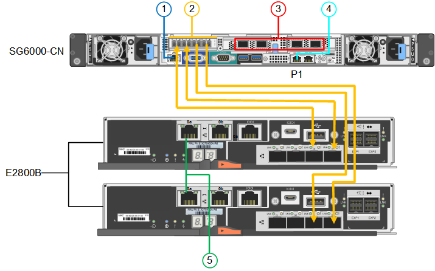

= 纜線應用裝置（SG6000）
:allow-uri-read: 
:icons: font
:imagesdir: ../media/

[role="lead"]
您可以將儲存控制器連接到 SG6000-CN 控制器、連接所有三個控制器上的管理連接埠、並將 SG6000-CN 控制器上的網路連接埠連接到 Grid Network 和選用的 Client Network for StorageGRID 。

.開始之前
* 設備隨附四條光纖纜線、可將兩個儲存控制器連接至SG6000-CN.控制器。
* 您有RJ-45乙太網路纜線（至少四條）可用來連接管理連接埠。
* 您有下列其中一個網路連接埠選項。本產品並未隨附這些項目。
+
** 一至四條雙軸纜線、用於連接四個網路連接埠。
** 一至四個SFP+或SFP28收發器、如果您打算將光纖纜線用於連接埠。
+

CAUTION: * 暴露於雷射輻射的風險 * - 請勿拆解或移除 SFP 收發器的任何部分。您可能會暴露在雷射輻射下。

.關於這項工作
下圖顯示 SG6060 和 SG6060X 設備中的三個控制器、其中 SG6000-CN 運算控制器位於上方、兩個 E2800 儲存控制器位於底部。SG6060 使用 E2800A 控制器、而 SG6060X 則使用 E2800B 控制器。

NOTE: E2800控制器的兩個版本都有相同的規格和功能、但互連連接埠的位置除外。

CAUTION: 請勿在同一個應用裝置中使用 E2800A 和 E2800B 控制器。

SG6060 連線：

image::../media/sg6000_e2800_connections.png[SG6060至E2800A連線]

SG6060X 連線：

下圖顯示SGF6024應用裝置中的三個控制器、其中SG6000-CN-運算控制器位於頂端、而兩個EF570儲存控制器位於運算控制器下方。

SGF6024 連線：

image::../media/sg6000_ef570_connections.png[SG6000至SGF570連線]

[cols="1a,2a,2a,3a"]
|===
| 標註 | 連接埠 | 連接埠類型 | 使用 

 a| 
1.
 a| 
SG6000-CN-控制器上的BMC管理連接埠
 a| 
1-GbE（RJ-45）
 a| 
連線至您存取BMC介面的網路。

 a| 
2.
 a| 
FC連線連接埠：

* 4在SG6000-CN.控制器上
* 每個儲存控制器2個

 a| 
16-Gb/s FC光纖SFP+
 a| 
將每個儲存控制器連接至SG6000-CN.控制器。

 a| 
3.
 a| 
SG6000-CN-控制器上有四個網路連接埠
 a| 
10/25-GbE
 a| 
連線到Grid Network和Client Network for StorageGRID the

 a| 
4.
 a| 
SG6000-CN 控制器上的管理網路連接埠（圖中標有 P1 ）
 a| 
1-GbE（RJ-45）

*重要事項：*此連接埠僅以1000 BaseT/完整運作、不支援10或100 MB的速度。
 a| 
將SG6000-CN-控制器連接至管理網路以StorageGRID 供實現

 a| 
 a| 
SG6000-CN-控制器上最右側的RJ-45連接埠
 a| 
1-GbE（RJ-45）

*重要事項：*此連接埠僅以1000 BaseT/完整運作、不支援10或100 MB的速度。
 a| 
* 如果您想要與管理網路建立備援連線、可以與管理連接埠1連結。
* 可保持無線連線、並可用於暫用本機存取（IP 169.254.0.1）。
* 安裝期間、如果無法使用 DHCP 指派的 IP 位址、則可用來將 SG6000-CN 控制器連接至服務筆記型電腦。

 a| 
5.
 a| 
每個儲存控制器上的管理連接埠1
 a| 
1-GbE（RJ-45）
 a| 
連線至您存取SANtricity 《系統管理程式》的網路。

 a| 
 a| 
每個儲存控制器上的管理連接埠2
 a| 
1-GbE（RJ-45）
 a| 
保留以供技術支援使用。

|===
.步驟
. 使用乙太網路纜線、將SG6000-CN控制器上的BMC管理連接埠連接至管理網路。
+
雖然此連線是選用的、但建議您協助支援。

. 將每個儲存控制器上的兩個FC連接埠、連接至SG6000-CN-控制器上的FC連接埠、使用四條光纖纜線和四個SFP+收發器來連接儲存控制器。
. 使用雙軸纜線或光纖纜線以及SFP+或SFP28收發器、將SG6000-CN-控制器上的網路連接埠連接至適當的網路交換器。
+

NOTE: 四個網路連接埠必須使用相同的連結速度。如果您打算使用10-GbE連結速度、請安裝SFP+收發器。如果您打算使用25-GbE連結速度、請安裝SFP28收發器。

+
** 如果您計畫使用固定連接埠連結模式（預設）、請將連接埠連接StorageGRID 至表格所示的「資訊網」和「用戶端網路」。
+
[cols="1a,2a"]
|===
| 連接埠 | 連線至... 

 a| 
連接埠1
 a| 
用戶端網路（選用）

 a| 
連接埠2
 a| 
網格網路

 a| 
連接埠3
 a| 
用戶端網路（選用）

 a| 
連接埠4.
 a| 
網格網路

|===
** 如果您打算使用Aggregate連接埠連結模式、請將一個或多個網路連接埠連接至一或多個交換器。您應該至少連接四個連接埠中的兩個、以避免單點故障。如果將多個交換器用於單一LACP連結、則交換器必須支援MLAG或等效的交換器。

. 如果您打算使用管理網路StorageGRID 來執行效能、請使用乙太網路纜線、將SG6000-CNN控制器上的管理網路連接埠連接至管理網路。
. 如果您打算使用管理網路來執行SANtricity 《支援不支援的系統管理程式》、SANtricity 請使用乙太網路纜線、將每個儲存控制器（左側RJ-45連接埠）上的管理連接埠1（P1）連接至管理網路、以利執行《支援系統管理程式》。
+
請勿在儲存控制器（右側的 RJ-45 連接埠）上使用管理連接埠 2 （ P2 ）。此連接埠保留供技術支援使用。

.相關資訊
link:../installconfig/port-bond-modes-for-sg6000-cn-controller.html["連接埠連結模式（ SG6000-CN 控制器）"]
