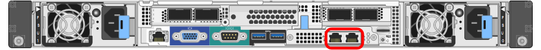
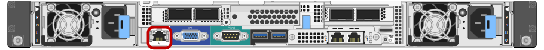

= 收集安裝資訊（SG100和SG1000）
:allow-uri-read: 
:icons: font
:imagesdir: ../media/

[role="lead"]
使用表格記錄您連線至應用裝置的每個網路所需的資訊。這些值是安裝和設定硬體所需的值。

TIP: 請使用 ConfigBuilder 隨附的活頁簿、而非使用表格。使用 ConfigBuilder 活頁簿可讓您上傳系統資訊並產生 JSON 檔案、以自動完成 StorageGRID 應用裝置安裝程式中的某些組態步驟。請參閱 link:automating-appliance-installation-and-configuration.html["自動化應用裝置的安裝與組態"]。

== 檢查 StorageGRID 版本

安裝 SG100 或 SG1000 服務應用裝置之前、請先確認您的 StorageGRID 系統使用的是所需版本的 StorageGRID 軟體。

[cols="1a,2a"]
|===
| 應用裝置 | 必要StorageGRID 的版本 

 a| 
SG1000
 a| 
11.3或更新版本（建議使用最新的修補程式）

 a| 
SG100
 a| 
11.4或更新版本（建議使用最新的修補程式）

|===

== 系統管理與維護連接埠

管理員網路for支援功能是選用的網路、可用於系統管理和維護。StorageGRID應用裝置會使用應用裝置上的下列1-GbE管理連接埠來連線至管理網路。

SG100 RJ-45 連接埠：

image::../media/sg100_rj_45_ports_circled.png[SG100 RJ-45 連接埠]

SG1000 RJ-45 連接埠：

[cols="2a,1a"]
|===
| 所需資訊 | 您的價值 

 a| 
管理網路已啟用
 a| 
請選擇一項：

* 否
* 是（預設）

 a| 
網路連結模式
 a| 
請選擇一項：

* Independent（預設）
* 主動備份

 a| 
圖中圈選左連接埠的交換器連接埠（獨立網路連結模式的預設作用中連接埠）
 a| 

 a| 
圖中圈選的右側連接埠的交換器連接埠（僅限主動備份網路連結模式）
 a| 

 a| 
管理網路連接埠的Mac位址

*附註：*設備正面的MAC位址標籤會列出BMC管理連接埠的MAC位址。若要判斷管理網路連接埠的 MAC 位址、請在標籤上的十六進位數字中新增 *2* 。例如、如果標籤上的MAC位址以* 09 *結尾、則管理連接埠的MAC位址將以* 0B*結尾。如果標籤上的MAC位址以*（_y_）FF*結尾、則管理連接埠的MAC位址將以*（_y_+1*）結尾。您可以在Windows中開啟「計算機」、將其設定為「程式設計師」模式、選取「Hex」、輸入MAC位址、然後輸入*+ 2 =*、輕鬆完成此計算。
 a| 

 a| 
DHCP指派給管理網路連接埠的IP位址（如果在開機後可用）

*注意：*您可以使用MAC位址來查詢指派的IP位址、藉此判斷DHCP指派的IP位址。
 a| 
* IPV4位址（CIDR）：
* 閘道：

 a| 
您計畫用於管理網路上應用裝置節點的靜態IP位址

*注意：*如果您的網路沒有閘道、請為閘道指定相同的靜態IPv4位址。
 a| 
* IPV4位址（CIDR）：
* 閘道：

 a| 
管理網路子網路（CIDR）
 a| 

|===

== 網路連接埠

應用裝置上的四個網路連接埠可連接StorageGRID 至「知識網」和選用的「用戶端網路」。

[cols="2a,1a"]
|===
| 所需資訊 | 您的價值 

 a| 
連結速度
 a| 
對於SG100、請選擇下列其中一項：

* 自動（預設）
* 10 GbE
* 25 GbE

對於SG1000、請選擇下列其中一項：

* 自動（預設）
* 10 GbE
* 25 GbE
* 40 GbE
* 100 GbE

*附註：* SG1000、10和25 GbE速度需要使用QSA介面卡。

 a| 
連接埠連結模式
 a| 
請選擇一項：

* 固定（預設）
* Aggregate

 a| 
連接埠1的交換器連接埠（固定模式的用戶端網路）
 a| 

 a| 
連接埠2的交換器連接埠（適用於固定模式的Grid Network）
 a| 

 a| 
連接埠3的交換器連接埠（固定模式的用戶端網路）
 a| 

 a| 
連接埠4的交換器連接埠（適用於固定模式的Grid Network）
 a| 

|===

== 網格網路連接埠

Grid Network for StorageGRID 效能不只是一項必要的網路、可用於所有內部StorageGRID 的資訊流量。應用裝置使用四個網路連接埠連線至Grid Network。

[cols="2a,1a"]
|===
| 所需資訊 | 您的價值 

 a| 
網路連結模式
 a| 
請選擇一項：

* 雙主動備份（預設）
* LACP（802.3ad）

 a| 
已啟用VLAN標記
 a| 
請選擇一項：

* 否（預設）
* 是的

 a| 
VLAN標記（如果已啟用VLAN標記）
 a| 
輸入介於0和4095之間的值：

 a| 
網格網路的DHCP指派IP位址（如果在開機後可用）
 a| 
* IPV4位址（CIDR）：
* 閘道：

 a| 
您計畫用於Grid Network上應用裝置節點的靜態IP位址

*注意：*如果您的網路沒有閘道、請為閘道指定相同的靜態IPv4位址。
 a| 
* IPV4位址（CIDR）：
* 閘道：

 a| 
網格網路子網路（CIDR）
 a| 

 a| 
最大傳輸單位（MTU）設定（選用）您可以使用預設值1500、或將MTU設為適合巨型框架（例如9000）的值。
 a| 

|===

== 用戶端網路連接埠

Client Network for StorageGRID 推銷是選用的網路、通常用於提供用戶端傳輸協定存取網格。應用裝置使用四個網路連接埠連線至用戶端網路。

[cols="2a,1a"]
|===
| 所需資訊 | 您的價值 

 a| 
用戶端網路已啟用
 a| 
請選擇一項：

* 否（預設）
* 是的

 a| 
網路連結模式
 a| 
請選擇一項：

* 雙主動備份（預設）
* LACP（802.3ad）

 a| 
已啟用VLAN標記
 a| 
請選擇一項：

* 否（預設）
* 是的

 a| 
VLAN 標記（如果已啟用 VLAN 標記）
 a| 
輸入介於0和4095之間的值：

 a| 
用戶端網路的DHCP指派IP位址（如果在開機後可用）
 a| 
* IPV4位址（CIDR）：
* 閘道：

 a| 
您計畫用於用戶端網路上應用裝置節點的靜態IP位址

*附註：*如果已啟用用戶端網路、則應用裝置上的預設路由將使用此處指定的閘道。
 a| 
* IPV4位址（CIDR）：
* 閘道：

|===

== BMC管理網路連接埠

您可以使用圖中圈出的1-GbE管理連接埠、存取服務應用裝置上的BMC介面。此連接埠支援使用智慧型平台管理介面（IPMI）標準、透過乙太網路遠端管理控制器硬體。

NOTE: 您可以使用管理 API 私有端點（ Put /Private / bmc ）來啟用或停用包含 BMC 的所有應用裝置的遠端 IPMI 存取。

SG100 BMC 管理連接埠：

image::../media/sg100_bmc_management_port.png[SG100管理連接埠]

SG1000 BMC 管理連接埠：

[cols="2a,1a"]
|===
| 所需資訊 | 您的價值 

 a| 
乙太網路交換器連接埠、您將連接至BMC管理連接埠（圖中圈出）
 a| 

 a| 
BMC管理網路的DHCP指派IP位址（如果在開機後可用）
 a| 
* IPV4位址（CIDR）：
* 閘道：

 a| 
您計畫用於BMC管理連接埠的靜態IP位址
 a| 
* IPV4位址（CIDR）：
* 閘道：

|===
.相關資訊
* link:cabling-appliance-sg100-and-sg1000.html["纜線應用裝置（SG100和SG1000）"]
* link:setting-ip-configuration.html["設定StorageGRID 靜態IP位址"]

