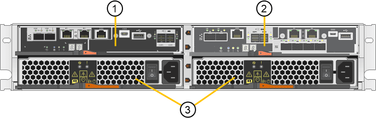

= SG5700 應用裝置：概覽
:allow-uri-read: 
:icons: font
:imagesdir: ../media/

[role="lead"]
SG5700 StorageGRID 產品是整合式儲存與運算平台、可在StorageGRID 整個網格中作為儲存節點運作。此應用裝置可在混合式網格環境中使用、此環境結合了應用裝置儲存節點和虛擬（軟體型）儲存節點。

SSG5700系列應用裝置提供下列功能：StorageGRID

* 整合StorageGRID 適用於整個過程的儲存與運算元素。
* 包含StorageGRID 用來簡化儲存節點部署和組態的《不再》應用裝置安裝程式。
* 包含E系列SANtricity 的《支援硬體管理與監控的系統管理程式》。
* 支援最多四個10-GbE或25-GbE連線至StorageGRID 「支援網格網」和「用戶端網路」。
* 支援全磁碟加密（ FDE ）磁碟機或 FIPS 磁碟機。當這些磁碟機搭配SANtricity 使用時、無法在未經授權的情況下存取資料。

SG5700應用裝置共有四種機型：SG5712和SG5712X、以及SG5760和SG5760X。除了儲存控制器上互連連接埠的位置、SG5712與SG5712X之間沒有任何規格或功能差異。同樣地、 SG5760 與 SG5760X 之間也沒有規格或功能上的差異、但儲存控制器上的互連連接埠位置除外。

== SG5700 元件

SG5700 機型包含下列元件：

[cols="1a,1a,1a,1a,1a"]
|===
| 元件 | SG5712 | SG5712X | SG5760 | SG5760X 

 a| 
運算控制器
 a| 
E5700SG控制器
 a| 
E5700SG控制器
 a| 
E5700SG控制器
 a| 
E5700SG控制器

 a| 
儲存控制器
 a| 
E2800A控制器
 a| 
E2800B控制器
 a| 
E2800A控制器
 a| 
E2800B控制器

 a| 
機箱
 a| 
E系列DE212C機箱、雙機架單元（2U）機箱
 a| 
E系列DE212C機箱、雙機架單元（2U）機箱
 a| 
E系列DE460C機箱、四個機架單元（4U）機箱
 a| 
E系列DE460C機箱、四個機架單元（4U）機箱

 a| 
磁碟機
 a| 
12個NL-SAS磁碟機（3.5吋）
 a| 
12個NL-SAS磁碟機（3.5吋）
 a| 
60個NL-SAS磁碟機（3.5吋）
 a| 
60個NL-SAS磁碟機（3.5吋）

 a| 
備援電源供應器與風扇
 a| 
兩個電源風扇迴廊
 a| 
兩個電源風扇迴廊
 a| 
兩個電源容器和兩個風扇容器
 a| 
兩個電源容器和兩個風扇容器

|===
根據每個機箱內的磁碟機數量、可固定使用該產品的最大原始儲存容量StorageGRID 。您無法透過新增含有額外磁碟機的機櫃來擴充可用的儲存設備。

== SG5700 圖表

=== SG5712 前後視圖

圖中所示為 SG5712 的前後端、這是一款 2U 機箱、可容納 12 個磁碟機。

image::../media/sg5712_front_and_back_views.gif[SG5712應用裝置的正面和背面]

=== SG5712 元件

SG5712包含兩個控制器和兩個電源風扇迴管。

[cols="1a,3a"]
|===
| 標註 | 說明 

 a| 
1.
 a| 
E2800A控制器（儲存控制器）

 a| 
2.
 a| 
E5700SG控制器（運算控制器）

 a| 
3.
 a| 
電源風扇迴道

|===

=== SG5712X 前後視圖

圖中所示為 SG5712X 的前後端、這是一款 2U 機箱、可容納 12 個磁碟機。

image::../media/sg5712x_front_and_back_views.gif[SG5712X應用裝置的正面和背面]

=== SG5712X 元件

SG5712X包含兩個控制器和兩個電源風扇迴管。

image::../media/sg5712x_with_callouts.gif[SG5712X應用裝置中的控制器和電源風扇容器]

[cols="1a,3a"]
|===
| 標註 | 說明 

 a| 
1.
 a| 
E2800B控制器（儲存控制器）

 a| 
2.
 a| 
E5700SG控制器（運算控制器）

 a| 
3.
 a| 
電源風扇迴道

|===

=== SG5760 前後視圖

圖中所示為 SG5760 機型的前後方、 4U 機箱可在 5 個磁碟機抽屜中容納 60 個磁碟機。

image::../media/sg5760_front_and_back_views.gif[SG5760應用裝置的正面和背面]

=== SG5760 元件

SG5760包含兩個控制器、兩個風扇迴管和兩個電源迴管。

image::../media/sg5760_with_callouts.gif[控制器,fan canisters,and power canisters in SG5760 appliance]

[cols="1a,2a"]
|===
| 標註 | 說明 

 a| 
1.
 a| 
E2800A控制器（儲存控制器）

 a| 
2.
 a| 
E5700SG控制器（運算控制器）

 a| 
3.
 a| 
風扇容器（第1個、共2個）

 a| 
4.
 a| 
電力箱（第1頁、共2頁）

|===

=== SG5760X 前後視圖

圖中所示為 SG5760X 機型的前後方、 4U 機箱可在 5 個磁碟機抽屜中容納 60 個磁碟機。

image::../media/sg5760x_front_and_back_views.gif[SG5760X應用裝置的正面和背面]

=== SG5760X 元件

SG5760X 包含兩個控制器、兩個風扇迴廊和兩個電源迴廊。

image::../media/sg5760x_with_callouts.gif[控制器,fan canisters,and power canisters in SG5760X appliance]

[cols="1a,3a"]
|===
| 標註 | 說明 

 a| 
1.
 a| 
E2800B控制器（儲存控制器）

 a| 
2.
 a| 
E5700SG控制器（運算控制器）

 a| 
3.
 a| 
風扇容器（第1個、共2個）

 a| 
4.
 a| 
電力箱（第1頁、共2頁）

|===
.相關資訊
http://["NetApp E系列系統文件網站"^]
