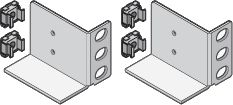

= 打開包裝盒
:allow-uri-read: 
:icons: font
:imagesdir: ../media/

[role="lead"]
安裝 StorageGRID 應用裝置之前、請先打開所有包裝盒的包裝、並將內容物與裝箱單上的物品進行比較。

== SGF6112 應用裝置

=== 硬體

[cols="1a,4a"]
|===
| 項目 | 外觀 

 a| 
SGF6112
 a| 
image::../media/sg6000_cn_front_without_bezel.gif[前置磁碟機 SGF6112 應用裝置]

 a| 
附說明的軌道套件
 a| 
image::../media/rail_kit.gif[軌道套件]

 a| 
前擋板
 a| 
image::../media/sgf_6112_front_bezel.png[前擋板]

|===

=== 電源線

SGF6112 產品的出貨產品包括下列電源線。

TIP: 您的機櫃可能有特殊的電源線、您可以使用這些電源線、而非產品隨附的電源線。

[cols="1a,4a"]
|===
| 項目 | 外觀 

 a| 
適用於您所在國家 / 地區的兩條電源線
 a| 
image::../media/power_cords.gif[電源線]

|===

== SG6000 應用裝置

=== SG6060 硬體

[cols="1a,4a"]
|===
| 項目 | 外觀 

 a| 
SG6000-CN.控制器
 a| 
image::../media/sg6000_cn_front_without_bezel.gif[SG6000-CN.控制器]

 a| 
E2860 控制器機櫃、未安裝磁碟機
 a| 
image::../media/de460c_table_size.gif[SG5760 4U應用裝置]

 a| 
兩個前擋板
 a| 
image::../media/sg6000_front_bezels_for_table.gif[前擋板]

 a| 
附說明的兩個軌道套件
 a| 
image::../media/rail_kit.gif[軌道套件]

 a| 
60 個磁碟機（ 2 個 SSD 和 58 個 NL-SAS ）
 a| 
image::../media/sg5760_drive.gif[磁碟機]

 a| 
四個控制點
 a| 
image::../media/handles.gif[SG5760處理]

 a| 
用於方孔機架安裝的後支架和鎖緊螺帽
 a| 

|===

=== SG6060擴充櫃

[cols="1a,4a"]
|===
| 項目 | 外觀 

 a| 
未安裝磁碟機的擴充機櫃
 a| 
image::../media/de460c_table_size.gif[SG5760 4U應用裝置]

 a| 
前擋板
 a| 
image::../media/front_bezel_for_table_de460c.gif[前擋板DE460C]

 a| 
60個NL-SAS磁碟機
 a| 
image::../media/sg5760_drive.gif[磁碟機]

 a| 
附說明的一種軌道套件
 a| 
image::../media/rail_kit.gif[軌道套件]

 a| 
四個控制點
 a| 
image::../media/handles.gif[SG5760處理]

 a| 
用於方孔機架安裝的後支架和鎖緊螺帽
 a| 

|===

=== SGF6024 硬體

[cols="1a,4a"]
|===
| 項目 | 外觀 

 a| 
SG6000-CN.控制器
 a| 
image::../media/sg6000_cn_front_without_bezel.gif[SG6000-CN.控制器]

 a| 
EF570 快閃陣列、安裝 24 個固態（ Flash ）磁碟機
 a| 
image::../media/de224c_with_drives.gif[EF570控制器機櫃]

 a| 
兩個前擋板
 a| 
image::../media/sgf6024_front_bezels_for_table.png[SG6024前擋板]

 a| 
附說明的兩個軌道套件
 a| 
image::../media/rail_kit.gif[軌道套件]

 a| 
機櫃端蓋
 a| 
image::../media/endcaps.png[端點]

|===

=== 纜線與連接器

SG6000 設備的出貨產品包括下列纜線和接頭。

TIP: 您的機櫃可能有特殊的電源線、您可以使用這些電源線、而非產品隨附的電源線。

[cols="1a,4a"]
|===
| 項目 | 外觀 

 a| 
適用於您所在國家 / 地區的四條電源線
 a| 
image::../media/power_cords.gif[電源線]

 a| 
光纖纜線和 SFP 收發器
 a| 
image::../media/fc_cable_and_sfp.gif[光纖纜線與SFP]

* 四條光纖纜線用於FC互連連接埠
* 四個SFP+收發器、支援16Gb/s FC

 a| 
選用：兩條 SAS 纜線、用於連接每個 SG6060 擴充機櫃
 a| 
image::../media/sas_cable.gif[SAS纜線]

|===

== SG5700 應用裝置

=== 硬體

[cols="1a,4a"]
|===
| 項目 | 外觀 

 a| 
SG5712 應用裝置、安裝 12 個磁碟機
 a| 
image::../media/de212c_table_size.gif[SG5712 2U應用裝置]

 a| 
SG5760 應用裝置、未安裝磁碟機
 a| 
image::../media/de460c_table_size.gif[SG5760 4U應用裝置]

 a| 
產品前擋板
 a| 
image::../media/sg5700_front_bezels.gif[SG5712與SG5760的擋板]

 a| 
附說明的軌道套件
 a| 
image::../media/rail_kit.gif[軌道套件]

 a| 
SG5760 ： 60 個磁碟機
 a| 
image::../media/sg5760_drive.gif[磁碟機]

 a| 
SG5760 ：握把
 a| 
image::../media/handles.gif[SG5760處理]

 a| 
SG5760 ：用於方孔機架安裝的後支架和鎖緊螺帽
 a| 

|===

=== 纜線與連接器

SG5700 應用裝置的出貨產品包括下列纜線和接頭。

TIP: 您的機櫃可能有特殊的電源線、您可以使用這些電源線、而非產品隨附的電源線。

[cols="1a,4a"]
|===
| 項目 | 外觀 

 a| 
適用於您所在國家 / 地區的兩條電源線
 a| 
image::../media/power_cords.gif[電源線]

 a| 
光纖纜線和 SFP 收發器
 a| 
image::../media/fc_cable_and_sfp.gif[光纖纜線與SFP]

* 兩條光纖纜線用於FC互連連接埠
* 八個SFP+收發器、可與四個16Gb/s FC互連連接埠和四個10-GbE網路連接埠相容

|===

== SG100 和 SG1000 設備

=== 硬體

[cols="1a,4a"]
|===
| 項目 | 外觀 

 a| 
SG100 或 SG1000
 a| 
image::../media/sg6000_cn_front_without_bezel.gif[前置磁碟機：SG 100或SG1000服務應用裝置]

 a| 
附說明的軌道套件
 a| 
image::../media/rail_kit.gif[軌道套件]

|===

=== 電源線

SG100 或 SG1000 設備的出貨產品包括下列電源線。

TIP: 您的機櫃可能有特殊的電源線、您可以使用這些電源線、而非產品隨附的電源線。

[cols="1a,4a"]
|===
| 項目 | 外觀 

 a| 
適用於您所在國家 / 地區的兩條電源線
 a| 
image::../media/power_cords.gif[電源線]

|===