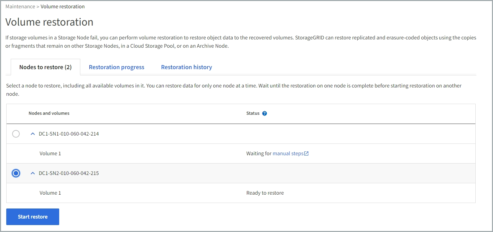

= 使用 Grid Manager 還原物件資料
:allow-uri-read: 
:icons: font
:imagesdir: ../media/

[role="lead"]
您可以使用 Grid Manager 還原故障儲存磁碟區或儲存節點的物件資料。您也可以使用 Grid Manager 來監控進行中的還原程序、並顯示還原歷程記錄。

.開始之前
* 您已完成下列任一程序、以格式化故障的磁碟區：
+
** link:../maintain/remounting-and-reformatting-appliance-storage-volumes.html["重新掛載及重新格式化應用裝置儲存磁碟區（手動步驟）"]
** link:../maintain/remounting-and-reformatting-storage-volumes-manual-steps.html["重新掛載及重新格式化儲存磁碟區（手動步驟）"]

* 您已確認還原物件的儲存節點的連線狀態為 * 已連線 * image:../media/icon_alert_green_checkmark.png["圖示警示綠色核取記號"] 在Grid Manager的* nodes *>* Overview *（*節點*>*總覽*）索引標籤上。
* 您已確認下列事項：
+
** 用於新增儲存節點的網格擴充未在處理中。
** 儲存節點取消委任未在處理中或失敗。
** 故障儲存磁碟區的恢復作業尚未進行。
** 系統磁碟機故障的儲存節點正在恢復中。
** EC 重新平衡工作未在處理中。
** 裝置節點複製未進行中。

.關於這項工作
在您更換磁碟機並執行手動步驟來格式化磁碟區之後、 Grid Manager 會在 * 維護 * > * 磁碟區還原 * > * 要還原的節點 * 標籤上顯示磁碟區作為還原候選項目。

請盡可能使用 Grid Manager 中的 * Volume 還原 * 頁面來還原物件資料。請遵循以下準則：

* 如果這些磁碟區列於 * 維護 * > * 磁碟區還原 * > * 要還原的節點 * 、請依照下列步驟還原物件資料。如果發生以下情況、將會列出這些磁碟區：
+
** 節點中的部分儲存磁碟區（但並非全部）發生故障
** 節點中的所有儲存磁碟區都發生故障、正在以相同數量的磁碟區或更多磁碟區取代

+
Grid Manager 中的「 Volume 還原」頁面也可讓您執行 <<view-restoration-progress,監控磁碟區還原程序>> 和 <<view-restoration-history,檢視還原歷史記錄>>。

* 如果 Grid Manager 中未列出磁碟區作為還原候選項目、請遵循適當的步驟來使用 `repair-data` 還原物件資料的指令碼：
+
** link:restoring-object-data-to-storage-volume.html["將物件資料還原至儲存磁碟區（系統磁碟機故障）"]
** link:restoring-object-data-to-storage-volume-where-system-drive-is-intact.html["將物件資料還原至系統磁碟機不受影響的儲存磁碟區"]
** link:restoring-object-data-to-storage-volume-for-appliance.html["將物件資料還原至應用裝置的儲存磁碟區"]

+
如果恢復的儲存節點所包含的磁碟區數量少於它所取代的節點、則必須使用 `repair-data` 指令碼：

您可以還原兩種類型的物件資料：

* 複寫的資料物件會從其他位置還原、前提是已將網格的 ILM 規則設定為可提供物件複本。
+
** 如果ILM規則設定為只儲存一個複寫複本、且該複本存在於故障的儲存磁碟區上、您將無法恢復物件。
** 如果物件的唯一剩餘複本位於Cloud Storage Pool中、StorageGRID 則必須向Cloud Storage Pool端點發出多個要求、才能還原物件資料。
** 如果物件的唯一剩餘複本位於歸檔節點、則會從歸檔節點擷取物件資料。從保存節點將物件資料還原至儲存節點所需的時間比從其他儲存節點還原物件複本所需的時間更長。

* 重新組裝儲存的片段、即可還原銷毀編碼（ EC ）資料物件。毀損或遺失的片段會由銷毀編碼演算法從剩餘資料和同位元檢查片段重新建立。

NOTE: 磁碟區還原視儲存物件複本的資源可用度而定。磁碟區還原的進度是非線性的、可能需要數天或數週才能完成。

== 還原故障的磁碟區或節點

請依照下列步驟還原故障的磁碟區或節點。

.步驟
. 在 Grid Manager 中、前往 * 維護 * > * Volume 還原 * 。
. 選取 * 要還原的節點 * 標籤。
+
索引標籤上的數字表示需要還原磁碟區的節點數。

+

. 展開每個節點、查看 IT 中需要還原的磁碟區及其狀態。
. 如果每個磁碟區顯示為磁碟區狀態、請修正在您選取「等待手動步驟」時、導致無法還原的任何問題。
. 選取要還原的節點、其中所有磁碟區都會顯示「準備還原」狀態。
+
您一次只能還原一個節點的磁碟區。

+
節點中的每個磁碟區都必須指出它已準備好還原。

. 選取 * 開始還原 * 。
. 解決可能出現的任何警告、或選取 * 無論如何啟動 * 以忽略警告並開始還原。

當還原開始時、節點會從 * 節點移至還原 * 索引標籤、移至 * 還原進度 * 索引標籤。

如果無法啟動磁碟區還原、節點會返回 * 節點以還原 * 標籤。

== [[view-store-progress]] 檢視還原進度

「 * 還原進度 * 」標籤會顯示磁碟區還原程序的狀態、以及要還原節點的磁碟區相關資訊。

image::../media/vol-restore-restore-progress.png[Volume 還原 - 還原進度索引標籤]

所有磁碟區中複寫和刪除編碼物件的資料修復率、均為平均、可摘要說明所有進行中的還原作業、包括使用啟動的還原作業 `repair-data` 指令碼：也會指出這些磁碟區中完整且不需要還原的物件百分比。

NOTE: 複寫資料還原視儲存複寫複本的資源可用度而定。複寫資料還原的進度是非線性的、可能需要數天或數週才能完成。

還原工作區段會顯示從 Grid Manager 開始的磁碟區還原資訊。

* 「還原工作」區段標題中的編號會指出正在還原或排入佇列以進行還原的磁碟區數量。
* 此表顯示正在還原之節點中每個磁碟區的相關資訊及其進度。
+
** 每個節點的進度會顯示每個工作的百分比。
** 展開詳細資料欄以顯示還原開始時間和工作 ID 。

* 如果磁碟區還原失敗：
+
** 「狀態」欄表示失敗。
** 出現錯誤、指出故障原因。
+
修正錯誤中指出的問題。然後選擇 * 重試 * 以重新啟動磁碟區還原。

+
如果多個還原工作失敗、選取 * 重試 * 會啟動最近失敗的工作。

== [[view-store-history ]] 檢視還原歷史記錄

「 * 還原歷史記錄 * 」標籤會顯示已成功完成的所有磁碟區還原資訊。

NOTE: 大小不適用於複寫物件、僅適用於包含抹除編碼（ EC ）資料物件的還原。

image::../media/vol-restore-restore-history.png[Volume 還原 - 還原歷史記錄索引標籤]
