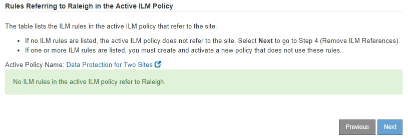

= 步驟3：修改ILM原則
:allow-uri-read: 
:icons: font
:imagesdir: ../media/

[role="lead"]
從取消委任網站精靈的步驟3（修訂ILM原則）中、您可以判斷該站台是否由作用中的ILM原則所參照。

.開始之前
您已充分瞭解 ILM 的運作方式、並熟悉如何建立儲存資源池、銷毀編碼設定檔、 ILM 規則、以及模擬及啟動 ILM 原則。請參閱 link:../ilm/index.html["使用ILM管理物件"]。

.關於這項工作
如果主動式 ILM 原則中的任何 ILM 規則都參照該站台，則 StorageGRID 無法取消委任該站台。

如果您目前的ILM原則是指您要移除的站台、則必須啟動符合特定需求的新ILM原則。具體而言、新的ILM原則：

* 無法使用參照網站或使用 [ 所有網站 ] 選項的儲存集區。
* 無法使用指向站台的銷毀編碼設定檔。
* 無法使用 StorageGRID 11.6 或舊版安裝的「複製 2 份複本」規則。
* 必須設計為完全保護所有物件資料。
+

IMPORTANT: 切勿建立單一複本ILM規則來因應網站移除作業。ILM規則只會在任何時間段建立一個複寫複本、使資料有永久遺失的風險。如果只有一個物件複寫複本存在、則當儲存節點故障或發生重大錯誤時、該物件就會遺失。在升級等維護程序期間、您也會暫時失去物件的存取權。

如果您執行_連線站台取消委任_、您必須考慮StorageGRID 如何管理目前位於您要移除之站台的物件資料。根據您的資料保護需求、新規則可以將現有的物件資料移至不同的站台、也可以刪除不再需要的任何額外物件複本。

如果您需要設計新原則的協助、請聯絡技術支援部門。

.步驟
. 從步驟3（修訂ILM原則）中、判斷作用中ILM原則中的任何ILM規則是否參照您選取要移除的站台。
. 如果未列出任何規則、請選取 * 下一步 * 以前往 link:step-4-remove-ilm-references.html["步驟4：移除ILM參考"]。
. 如果表格中列出一或多個ILM規則、請選取「*作用中原則名稱*」旁的連結。
+
ILM 原則頁面會出現在新的瀏覽器索引標籤中。使用此索引標籤更新ILM。「取消委任網站」頁面仍會在「其他」索引標籤上保持開啟狀態。

+
.. 如有必要、請選取 * ILM * > * 儲存資源池 * 、以建立一個或多個不參照網站的儲存資源池。
+

NOTE: 如需詳細資訊、請參閱資訊生命週期管理的物件管理說明。

.. 如果您打算使用銷毀編碼、請選取 * ILM * > * 銷毀編碼 * 來建立一個或多個銷毀編碼設定檔。
+
您必須選取不參照網站的儲存資源池。

+

NOTE: 請勿在銷毀編碼設定檔中使用 * 所有儲存節點 * 儲存池（ StorageGRID 11.6 及更早版本）。

. 選取「* ILM *>* Rules *」、然後複製步驟3（「修訂ILM原則」）表格中列出的每個規則。
+

NOTE: 如需詳細資訊、請參閱資訊生命週期管理的物件管理說明。

+
.. 使用可讓您在新原則中輕鬆選取這些規則的名稱。
.. 更新放置指示。
+
移除任何參照網站的儲存集區或銷毀編碼設定檔、並以新的儲存集區或銷毀編碼設定檔取代它們。

+

NOTE: 請勿在新規則中使用 * 所有儲存節點 * 儲存池。

. 選取「* ILM *>* Policies」*、然後建立使用新規則的新原則。
+

NOTE: 如需詳細資訊、請參閱資訊生命週期管理的物件管理說明。

+
.. 選取作用中原則、然後選取* Clone（複製）*。
.. 指定原則名稱和變更理由。
.. 選取複製原則的規則。
+
*** 清除「取消委任網站」頁面的步驟 3 （修訂 ILM 原則）中列出的所有規則。
*** 選取不參照站台的預設規則。
+

NOTE: 請勿選取 * 製作 2 份複本 * 規則、因為該規則使用 * 所有儲存節點 * 儲存池、這是不允許的。

*** 選取您建立的其他替代規則。這些規則不應指站台。
+
image::../media/decommission_site_step_3_cloned_policy.png[取消委任站台步驟3複製原則]

.. 選擇*應用*。
.. 拖曳資料列以重新排序原則中的規則。
+
您無法移動預設規則。

+

IMPORTANT: 您必須確認ILM規則的順序正確。當原則啟動時、新物件和現有物件會依照列出的順序進行評估、從上方開始。

.. 儲存建議的原則。

. 擷取測試物件、並模擬建議的原則、以確保套用正確的規則。
+

CAUTION: ILM原則中的錯誤可能導致無法恢復的資料遺失。在啟動原則之前、請仔細檢閱並模擬原則、以確認其運作正常。

+

CAUTION: 當您啟動新的ILM原則時StorageGRID 、利用它來管理所有物件、包括現有物件和新擷取的物件。在啟動新的ILM原則之前、請先檢閱現有複寫和銷毀編碼物件放置位置的任何變更。變更現有物件的位置、可能會在評估和實作新放置位置時、導致暫時性資源問題。

. 啟動新原則。
+
如果您正在執行連線站台取消委任、StorageGRID 則只要啟動新的ILM原則、即可立即從所選站台移除物件資料。移動或刪除所有物件複本可能需要數週的時間。雖然您可以在站台上仍存在物件資料的情況下安全地啟動站台取消委任、但如果您允許在開始實際取消委任程序之前、從站台移除資料、則取消委任程序將會更快完成、並減少中斷和效能影響 （在精靈的步驟5中選取*開始取消委任*）。

. 返回*步驟3（修訂ILM原則）*、以確保新作用中原則中的ILM規則不會參照站台、且* Next*按鈕已啟用。
+

+

NOTE: 如果列出任何規則、您必須先建立並啟動新的ILM原則、才能繼續。

. 如果未列出任何規則、請選取*下一步*。
+
此時會出現步驟4（移除ILM參考）。

