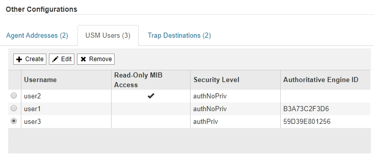

= 設定SNMP代理程式
:allow-uri-read: 
:icons: font
:imagesdir: ../media/

[role="lead"]
如果您想要使用協力廠商SNMP管理系統進行唯讀的MIB存取和通知、可以設定StorageGRID 靜態SNMP代理程式。

.開始之前
* 您將使用登入Grid Manager link:../admin/web-browser-requirements.html["支援的網頁瀏覽器"]。
* 您擁有root存取權限。

.關於這項工作
支援所有三種版本的SNMP傳輸協定的Sof SNMP代理程式。StorageGRID您可以為代理程式設定一或多個版本。

.步驟
. 選擇*組態*>*監控*>* SNMP代理程式*。
+
此時會顯示「SNMP代理程式」頁面。

+
image::../media/snmp_agent_not_enabled.png[SNMP代理程式未啟用]

. 若要在所有網格節點上啟用 SNMP 代理程式、請選取 * 啟用 SNMP* 核取方塊。
+
此時會顯示用於設定SNMP代理程式的欄位。

+
image::../media/snmp_agent_page.png[SNMP代理程式頁面]

. 在*系統聯絡人*欄位中、輸入StorageGRID 您要在SysContact的SNMP訊息中提供的值。
+
系統聯絡人通常是電子郵件地址。您所提供的價值適用於StorageGRID 整個過程中的所有節點。*系統聯絡人*最多可包含255個字元。

. 在*系統位置*欄位中、輸入StorageGRID 您要在SysLocation的SNMP訊息中提供的值。
+
System Location（系統位置）可以是任何有助於辨識StorageGRID 出您的系統所在位置的資訊。例如、您可以使用設施的街道地址。您所提供的價值適用於StorageGRID 整個過程中的所有節點。*系統位置*最多可包含255個字元。

. 如果您希望 StorageGRID SNMP 代理程式傳送設陷和通知通知、請保持選取「 * 啟用 SNMP 代理程式通知 * 」核取方塊。
+
如果清除此核取方塊、則 SNMP 代理程式支援唯讀 MIB 存取、但不會傳送任何 SNMP 通知。

. 如果您希望 StorageGRID SNMP 代理程式在收到驗證不正確的傳輸協定訊息時傳送驗證陷阱、請選取 * 啟用驗證陷阱 * 核取方塊。
. 如果您使用的是SNMPv1或SNMPv2c、請完成「社群字串」區段。
+
本節中的欄位用於在SNMPv1或SNMPv2c中進行社群型驗證。這些欄位不適用於 SNMPv3 。

+
.. 在*預設設陷社群*欄位中、輸入您要用於設陷目的地的預設社群字串（選用）。
+
視需要、您可以在使用時提供不同的（「custom」）社群字串 <<select_trap_destination,定義特定的陷阱目的地>>。

+
* 預設陷阱社群 * 最多可有 32 個字元、且不可包含空格字元。

.. 若為*唯讀社群*、請輸入一或多個社群字串、以允許對IPv4和IPv6代理程式位址進行唯讀的MIB存取。選取加號 image:../media/icon_plus_sign_black_on_white_old.png["加號"] 以新增多個字串。
+
當管理系統查詢StorageGRID 到這個功能時、它會傳送一個社群字串。如果社群字串符合此處指定的其中一個值、SNMP代理程式會傳送回應給管理系統。

+
每個社群字串最多可以有 32 個字元、而且不能包含空白字元。最多允許五個字串。

+

NOTE: 為確保 StorageGRID 系統的安全性、請勿使用「 public 」作為社群字串。如果您未輸入社群字串、 SNMP 代理程式會使用 StorageGRID 系統的網格 ID 做為社群字串。

. 或者、選取「其他組態」區段中的「代理程式位址」索引標籤。
+
使用此索引標籤可指定一或多個「偵聽位址」。 以下是SNMP代理程式可接收查詢的功能位址。StorageGRID每個代理程式位址都包含網際網路傳輸協定、傳輸傳輸協定、StorageGRID 一個鏈路、以及一個連接埠（可選）。

+
如果您未設定代理程式位址、則所有 StorageGRID 網路上的預設聆聽位址為 UDP 連接埠 161 。

+
.. 選擇* Create *（建立*）。
+
此時會出現「建立代理程式位址」對話方塊。

+
image::../media/snmp_create_agent_address.png[SNMP代理程式位址]

.. 若為*網際網路傳輸協定*、請選取此位址是否使用IPV4或IPV6。
+
依預設、SNMP使用的是IPV4。

.. 若為*傳輸傳輸傳輸協定*、請選取此位址是否使用udp或tcp。
+
依預設、SNMP使用的是udp。

.. 在* StorageGRID 《*》「網路*」欄位中、選取StorageGRID 查詢的接收範圍。
+
*** Grid、管理和用戶端網路：StorageGRID 在這三個網路上、Sfor SNMP查詢應由其偵聽。
*** 網格網路
*** 管理網路
*** 用戶端網路
+

NOTE: 為確保用戶端與StorageGRID 功能不致受到保護、您不應為用戶端網路建立代理程式位址。

.. 在「*連接埠*」欄位中、選擇性地輸入SNMP代理程式應接聽的連接埠號碼。
+
SNMP代理程式的預設udp連接埠為161、但您可以輸入任何未使用的連接埠號碼。

+

NOTE: 儲存SNMP代理程式時StorageGRID 、會自動開啟內部防火牆上的代理程式位址連接埠。您必須確保任何外部防火牆都允許存取這些連接埠。

.. 選擇* Create *（建立*）。
+
代理程式位址隨即建立並新增至表格。

+
image::../media/snmp_other_configurations_agent_addresses_table.png[SNMP其他組態代理程式位址表]

. 如果您使用的是v3、請選取「其他組態」區段中的「USM使用者」索引標籤。
+
使用此索引標籤可定義有權查詢mib或接收陷阱和通知的USM使用者。

+

NOTE: 如果您只使用SNMPv1或SNMPv2c、則不適用此步驟。

+
.. 選擇* Create *（建立*）。
+
「Create USM User」（建立USM使用者）對話方塊隨即出現。

+
image::../media/snmp_create_usm_user.png[SNMP USM使用者]

.. 輸入此USM使用者的唯一*使用者名稱*。
+
使用者名稱最多 32 個字元、不能包含空格字元。建立使用者後、無法變更使用者名稱。

.. 如果此使用者應該擁有 MIB 的唯讀存取權、請選取「 * 唯讀 MIB 存取 * 」核取方塊。
+
如果您選取*唯讀的mib存取*、*驗證引擎ID*欄位就會停用。

+

NOTE: 具有唯讀 MIB 存取權的 USM 使用者無法擁有引擎 ID 。

.. 如果此使用者將用於通知目的地、請輸入此使用者的*驗證引擎ID*。
+

NOTE: v3 INFORM目的地必須有具備引擎ID的使用者。SNMPv3 設陷目的地不能有具有引擎 ID 的使用者。

+
驗證引擎ID可以是5到32個位元組、採用16進位格式。

.. 選取USM使用者的安全層級。
+
*** *驗證權限*：此使用者與驗證和隱私權（加密）通訊。您必須指定驗證傳輸協定和密碼、以及隱私權傳輸協定和密碼。
*** *驗證NoPrimv*：此使用者可與驗證通訊、且無隱私權（無加密）。您必須指定驗證傳輸協定和密碼。

.. 輸入並確認此使用者用於驗證的密碼。
+

NOTE: 唯一支援的驗證傳輸協定是SHa（HMC-SHA-96）。

.. 如果您選取*驗證權限*、請輸入並確認此使用者將用於隱私的密碼。
+

NOTE: 唯一支援的隱私權傳輸協定是AES。

.. 選擇* Create *（建立*）。
+
系統會建立USM使用者並將其新增至表格。

+

. [SELECT（選取）陷阱目的地、start（開始）=10]在「其他組態」區段中、選取「設陷目的地」索引標籤。
+
設陷目的地索引標籤可讓您定義一個或多個目的地、以供StorageGRID 捕捉或通知。當您啟用 SNMP 代理程式並選取 * 儲存 * 時、 StorageGRID 會開始傳送通知給每個定義的目的地。觸發警示時會傳送通知。也會針對支援的MIB-II實體（例如ifdown和coldStart）傳送標準通知。

+
.. 選擇* Create *（建立*）。
+
「建立設陷目的地」對話方塊隨即出現。

+
image::../media/snmp_create_trap_destination.png[SNMP建立設陷目的地]

.. 在*版本*欄位中、選取要用於此通知的SNMP版本。
.. 根據您選擇的版本填寫表單
+
[cols="1a,2a"]
|===
| 版本 | 請指定此資訊 

 a| 
SNMPv1

（對於 SNMPv1 、 SNMP 代理程式只能傳送設陷。通知不受支援。）
 a| 
... 在*主機*欄位中、輸入要接收陷阱的IPV4或IPv6位址（或FQDN）。
... 若為*連接埠*、請使用預設值（162）、除非您必須使用其他值。（162是SNMP設陷的標準連接埠。）
... 對於*傳輸協定*、請使用預設（udp）。也支援TCP。（udp是標準的SNMP設陷傳輸協定。）
... 使用預設的陷阱社群（如果已在SNMP Agent頁面上指定）、或為此設陷目的地輸入自訂的社群字串。
+
自訂社群字串最多可以有 32 個字元、而且不能包含空格。

 a| 
SNMPv2c
 a| 
... 選取目的地將用於設陷或通知。
... 在*主機*欄位中、輸入要接收陷阱的IPV4或IPv6位址（或FQDN）。
... 若為*連接埠*、請使用預設值（162）、除非您必須使用其他值。（162是SNMP設陷的標準連接埠。）
... 對於*傳輸協定*、請使用預設（udp）。也支援TCP。（udp是標準的SNMP設陷傳輸協定。）
... 使用預設的陷阱社群（如果已在SNMP Agent頁面上指定）、或為此設陷目的地輸入自訂的社群字串。
+
自訂社群字串最多可以有 32 個字元、而且不能包含空格。

 a| 
v3
 a| 
... 選取目的地將用於設陷或通知。
... 在*主機*欄位中、輸入要接收陷阱的IPV4或IPv6位址（或FQDN）。
... 若為*連接埠*、請使用預設值（162）、除非您必須使用其他值。（162是SNMP設陷的標準連接埠。）
... 對於*傳輸協定*、請使用預設（udp）。也支援TCP。（udp是標準的SNMP設陷傳輸協定。）
... 選取要用於驗證的USM使用者。
+
**** 如果您選取* Trap *、則只會顯示沒有授權引擎ID的USM使用者。
**** 如果您選取* INFUS*、則只會顯示具有驗證引擎ID的USM使用者。

|===
.. 選擇* Create *（建立*）。
+
陷阱目的地隨即建立並新增至表格。

. 完成 SNMP 代理程式組態後、請選取 * 儲存 * 。
+
新的SNMP代理程式組態會變成作用中狀態。

.相關資訊
link:silencing-alert-notifications.html["靜音警示通知"]
