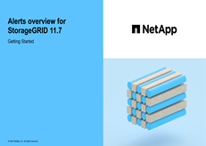

= 管理警示：總覽
:allow-uri-read: 
:icons: font
:imagesdir: ../media/

[role="lead"]
警示系統提供易於使用的介面、可偵測、評估及解決StorageGRID 在執行過程中可能發生的問題。

您可以建立自訂警示、編輯或停用警示、以及管理警示通知。

若要深入瞭解：

* 觀看影片： https://netapp.hosted.panopto.com/Panopto/Pages/Viewer.aspx?id=18df5a3d-bf19-4a9e-8922-afbd009b141b["影片： StorageGRID 11.7 警示綜覽"^]
+
[link=https://netapp.hosted.panopto.com/Panopto/Pages/Viewer.aspx?id=18df5a3d-bf19-4a9e-8922-afbd009b141b]

* 觀看影片： https://netapp.hosted.panopto.com/Panopto/Pages/Viewer.aspx?id=61acb7ba-7683-488a-a689-afb7010088f3["影片：使用度量在 StorageGRID 11.7 中建立自訂警示"^]
+
[link=https://netapp.hosted.panopto.com/Panopto/Pages/Viewer.aspx?id=61acb7ba-7683-488a-a689-afb7010088f3]
image::../media/video-screenshot-alert-create-custom-117.png[影片：使用度量在 StorageGRID 11.7 中建立自訂警示]

* 請參閱 link:alerts-reference.html["警示參考資料"]。

