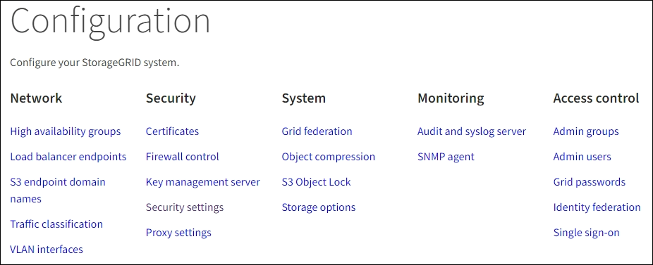

= 瀏覽Grid Manager
:allow-uri-read: 
:icons: font
:imagesdir: ../media/

[role="lead"]
Grid Manager是瀏覽器型的圖形介面、可讓您設定、管理StorageGRID 及監控您的作業系統。

當您登入Grid Manager時、即連線至管理節點。每StorageGRID 個系統包含一個主要管理節點和任意數量的非主要管理節點。您可以連線至任何管理節點、每個管理節點都會顯示StorageGRID 類似的畫面、顯示有關該系統的資訊。

您可以使用存取Grid Manager link:../admin/web-browser-requirements.html["支援的網頁瀏覽器"]。

== Grid Manager儀表板

當您第一次登入 Grid Manager 時、您可以使用儀表板一目瞭然地監控系統活動。

儀表板包含系統健全狀況和效能、儲存使用、 ILM 程序、 S3 和 Swift 作業、以及網格中的節點等相關資訊。您可以從包含有效監控系統所需資訊的卡片集合中選取、以設定儀表板。

image::../media/grid_manager_dashboard.png[Grid Manager中的儀表板]

如需每張卡片所顯示資訊的說明、請選取說明圖示 image:../media/icon_nms_question.png["問號圖示"] 適用於該卡。

.深入瞭解
* link:../monitor/viewing-dashboard.html["檢視及設定儀表板"]

== 搜尋欄位

標頭列中的*搜尋*欄位可讓您快速瀏覽至Grid Manager中的特定頁面。例如、您可以輸入 * km * 來存取金鑰管理伺服器（ KMS ）頁面。您可以使用*搜尋*來尋找Grid Manager側邊列和組態、維護及支援功能表上的項目。

== 說明功能表

說明功能表  可存取 FabricPool 和 S3 設定精靈、目前版本的 StorageGRID 文件中心、以及 API 文件。您也可以判斷StorageGRID 目前安裝的是哪個版本的更新版本。

image::../media/help_menu.png[說明功能表]

.深入瞭解
* link:../fabricpool/use-fabricpool-setup-wizard.html["使用 FabricPool 設定精靈"]
* link:../admin/use-s3-setup-wizard.html["使用 S3 設定精靈"]
* link:../admin/using-grid-management-api.html["使用Grid Management API"]

== 警示功能表

警示功能表提供易於使用的介面、可偵測、評估及解決StorageGRID 可能在執行過程中發生的問題。

image::../media/alerts_menu.png[警示功能表]

您可以從警示功能表執行下列動作：

* 檢閱目前的警示
* 檢閱已解決的警示
* 設定靜音以隱藏警示通知
* 針對觸發警示的條件定義警示規則
* 設定電子郵件伺服器以接收警示通知

.深入瞭解
* link:../monitor/managing-alerts.html["管理警示"]

== 節點頁面

「節點」頁面會顯示整個網格、網格中的每個站台、以及站台中的每個節點的相關資訊。

節點首頁會顯示整個網格的合併度量。若要檢視特定站台或節點的資訊、請選取站台或節點。

image::../media/nodes_menu.png[節點頁面主頁]

.深入瞭解
* link:../monitor/viewing-nodes-page.html["檢視「節點」頁面"]

== 租戶頁面

「租戶」頁面可讓您建立及監控StorageGRID 適用於您的作業系統的儲存租戶帳戶。您必須建立至少一個租戶帳戶、以指定誰可以儲存及擷取物件、以及哪些功能可供他們使用。

「租戶」頁面也會提供每個租戶的使用詳細資料、包括使用的儲存容量和物件數目。如果您在建立租戶時設定配額、就可以查看該配額的使用量。

image::../media/tenants_menu_and_page.png[租戶功能表和頁面]

.深入瞭解
* link:../admin/managing-tenants.html["管理租戶"]
* link:../tenant/index.html["使用租戶帳戶"]

== ILM功能表

ILM功能表可讓您設定資訊生命週期管理（ILM）規則和原則、以管理資料的持久性和可用度。您也可以輸入物件識別碼、以檢視該物件的中繼資料。

image::../media/ilm_menu_and_page.png[ILM功能表與頁面]

.深入瞭解
* link:using-information-lifecycle-management.html["使用資訊生命週期管理"]
* link:../ilm/index.html["使用ILM管理物件"]

== 組態功能表

「組態」功能表可讓您指定網路設定、安全性設定、系統設定、監控選項及存取控制選項。

=== 網路工作

網路工作包括：

* link:../admin/managing-high-availability-groups.html["管理高可用度群組"]
* link:../admin/managing-load-balancing.html["管理負載平衡器端點"]
* link:../admin/configuring-s3-api-endpoint-domain-names.html["設定 S3 端點網域名稱"]
* link:../admin/managing-traffic-classification-policies.html["管理流量分類原則"]
* link:../admin/configure-vlan-interfaces.html["設定 VLAN 介面"]

=== 安全性工作

安全性工作包括：

* link:../admin/using-storagegrid-security-certificates.html["管理安全性憑證"]
* link:../admin/manage-firewall-controls.html["管理內部防火牆控制"]
* link:../admin/kms-configuring.html["設定金鑰管理伺服器"]
* 設定安全性設定、包括 link:../admin/manage-tls-ssh-policy.html["TLS 和 SSH 原則"]、 link:../admin/changing-network-options-object-encryption.html["網路和物件安全選項"]和 link:../admin/changing-browser-session-timeout-interface.html["瀏覽器閒置逾時"]。
* 設定的設定 link:../admin/configuring-storage-proxy-settings.html["儲存代理伺服器"] 或是 link:../admin/configuring-admin-proxy-settings.html["管理 Proxy"]

=== 系統工作

系統工作包括：

* 使用 link:../admin/grid-federation-overview.html["網格同盟"] 在兩個 StorageGRID 系統之間複製租戶帳戶資訊及複寫物件資料。
* 您也可以啟用 link:../admin/configuring-stored-object-compression.html["壓縮儲存的物件"] 選項。
* link:../ilm/managing-objects-with-s3-object-lock.html["管理 S3 物件鎖定"]
* 瞭解儲存選項、例如 link:../admin/what-object-segmentation-is.html["物件分割"] 和 link:../admin/what-storage-volume-watermarks-are.html["儲存Volume浮點"]。

=== 監控工作

監控工作包括：

* link:../monitor/configure-audit-messages.html["設定稽核訊息和記錄目的地"]
* link:../monitor/using-snmp-monitoring.html["使用SNMP監控"]

=== 存取控制工作

存取控制工作包括：

* link:../admin/managing-admin-groups.html["管理管理群組"]
* link:../admin/managing-users.html["管理管理員使用者"]
* 變更 link:../admin/changing-provisioning-passphrase.html["資源配置複雜密碼"] 或 link:../admin/change-node-console-password.html["節點主控台密碼"]
* link:../admin/using-identity-federation.html["使用身分識別聯盟"]
* link:../admin/configuring-sso.html["設定 SSO"]

== 維護功能表

「維護」功能表可讓您執行維護工作、系統維護和網路維護。

image::../media/maintenance_menu.png[維護功能表和頁面]

=== 工作

維護工作包括：

* link:../maintain/decommission-procedure.html["取消委任作業"] 移除未使用的網格節點和站台
* link:../expand/index.html["擴充作業"] 新增網格節點和站台
* link:../maintain/grid-node-recovery-procedures.html["網格節點還原程序"] 更換故障節點並還原資料
* link:../maintain/rename-grid-site-node-overview.html["重新命名程序"] 可更改網格、站點和節點的顯示名稱
* link:../troubleshoot/verifying-object-integrity.html["物件存在檢查作業"] 驗證物件資料是否存在（雖然不是正確的）
* link:../maintain/restoring-volume.html["Volume 還原作業"]

=== 系統

您可以執行的系統維護工作包括：

* link:../admin/viewing-storagegrid-license-information.html["檢視StorageGRID 功能介紹資訊"] 或 link:../admin/updating-storagegrid-license-information.html["更新授權資訊"]
* 產生及下載 link:../maintain/downloading-recovery-package.html["恢復套件"]
* 在選定設備上執行 StorageGRID 軟體更新、包括軟體升級、 Hotfix 及 SANtricity OS 軟體更新
+
** link:../upgrade/index.html["升級程序"]
** link:../maintain/storagegrid-hotfix-procedure.html["修復程序"]
** link:../sg6000/upgrading-santricity-os-on-storage-controllers-using-grid-manager-sg6000.html["使用 Grid Manager 升級 SG6000 儲存控制器上的 SANtricity OS"]
** link:../sg5700/upgrading-santricity-os-on-storage-controllers-using-grid-manager-sg5700.html["使用 Grid Manager 升級 SG5700 儲存控制器上的 SANtricity OS"]

=== 網路

您可以執行的網路維護工作包括：

* link:../maintain/configuring-dns-servers.html["設定DNS伺服器"]
* link:../maintain/updating-subnets-for-grid-network.html["正在更新 Grid Network 子網路"]
* link:../maintain/configuring-ntp-servers.html["管理 NTP 伺服器"]

== 支援功能表

「支援」功能表提供的選項可協助技術支援人員分析及疑難排解您的系統。「支援」功能表有三個部分：工具、警示（舊版）及其他。

image::../media/support_menu.png[支援功能表]

=== 工具

從「支援」功能表的「工具」區段、您可以：

* link:../admin/configure-autosupport-grid-manager.html["設定AutoSupport 功能"]
* link:../monitor/running-diagnostics.html["執行診斷"] 位於網格的目前狀態
* link:../monitor/viewing-grid-topology-tree.html["存取 Grid 拓撲樹狀結構"] 可查看網格節點、服務和屬性的詳細信息
* link:../monitor/collecting-log-files-and-system-data.html["收集記錄檔和系統資料"]
* link:../monitor/reviewing-support-metrics.html["檢視支援指標"]
+

NOTE: * Metrics *選項提供的工具、是專供技術支援使用。這些工具中的某些功能和功能表項目是刻意無法運作的。

=== 警示（舊版）

從「支援」功能表的「警示（舊版）」區段、您可以檢閱目前、歷史和全域警示、設定自訂事件、以及設定舊版警示的電子郵件通知。請參閱 link:../monitor/managing-alarms.html["管理警示（舊系統）"]。

NOTE: 雖然舊版警示系統仍持續受到支援、但警示系統可提供顯著效益、而且使用起來更輕鬆。
