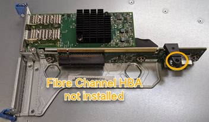

= 重新安裝Fibre Channel HBA
:allow-uri-read: 
:icons: font
:imagesdir: ../media/

[role="lead"]
替換的Fibre Channel HBA安裝在與移除HBA相同的位置。

.開始之前
* 您擁有正確的備用Fibre Channel HBA。
* 您已移除現有的Fibre Channel HBA。
+
link:removing-fibre-channel-hba.html["移除Fibre Channel HBA"]

.步驟
. 將防靜電腕帶的綁帶末端包覆在您的腕帶上、並將扣夾末端固定在金屬接地上、以避免產生靜電。
. 從包裝中取出更換的Fibre Channel HBA。
. 將藍色介面卡鎖定在開啟位置時、將光纖通道HBA與其在擴充卡組件上的連接器對齊、然後小心地將介面卡壓入連接器、直到它完全就位。
+
image::../media/sg6060_fc_hba_location.jpg[SG6060 Fibre Channel HBA（位於提升板組件中）]

+
提升板組件中有兩個介面卡：一個光纖通道HBA和一個乙太網路介面卡。如圖所示、光纖通道HBA。

. 找到與主機板上的導引插銷對齊的提升板組件（圈圈）上的定位孔、以確保正確的提升板組件定位。
+

. 將提升板部件放入機箱中，確保其與系統板上的連接器和導向銷對齊，然後插入提升板部件。
. 小心地沿着藍色標記孔旁的中心線將提升部件按入到位，直到其完全就位。
. 從要重新安裝纜線的光纖通道HBA連接埠取下保護蓋。

.完成後
如果您沒有其他維護程序可在控制器中執行、請重新安裝控制器護蓋。

link:reinstalling-sg6000-cn-controller-cover.html["重新安裝SG6000-CN-控制器護蓋"]
