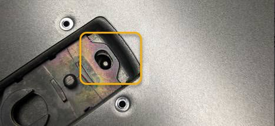

= 重新安裝SG6000-CN-控制器護蓋
:allow-uri-read: 
:icons: font
:imagesdir: ../media/

[role="lead"]
內部硬體維護完成後、請重新安裝控制器護蓋。

.開始之前
您已完成控制器內部的所有維護程序。

.步驟
. 打開機箱蓋栓鎖時、將機箱上方的機箱蓋固定、並將機箱頂蓋栓鎖上的孔對準機箱中的插銷。將機箱蓋對齊後、將其放低到機箱上。
+

. 向前或向下轉動機箱蓋栓鎖、直到其停止、並將機箱蓋完全裝入機箱。確認機箱蓋前緣沒有任何間隙。
+
如果機箱蓋未完全就位、您可能無法將SG6000-CN-控制器滑入機架。

. 選用：將藍色的塑膠鎖栓鎖朝鎖定方向轉動四分之一圈、如鎖銷鎖上所示、即可將其鎖定。

.完成後
將控制器重新安裝到機櫃或機架中。

link:reinstalling-sg6000-cn-controller-into-cabinet-or-rack.html["將SG6000-CN-控制器重新安裝到機櫃或機架中"]
