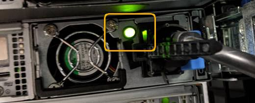

= 關閉SG6000-CN.控制器
:allow-uri-read: 
:icons: font
:imagesdir: ../media/

[role="lead"]
關閉SG6000-CN-控制器以執行硬體維護。

.開始之前
* 您已實際找到需要在資料中心進行維護的SG6000-CN.控制器。請參閱 link:locating-controller-in-data-center.html["在資料中心找到控制器"]。

.關於這項工作
為了避免服務中斷、請在關閉控制器之前、確認所有其他儲存節點均已連接至網格、或在可接受服務中斷期間的排程維護期間關閉控制器。請參閱相關資訊 link:../monitor/monitoring-system-health.html#monitor-node-connection-states["監控節點連線狀態"]。

IMPORTANT: 如果您曾經使用過僅建立物件複本的ILM規則、則必須在排程的維護期間關閉控制器。否則、在此程序期間、您可能會暫時失去對這些物件的存取權。+查看資訊生命週期管理的物件管理資訊。

.步驟
. 關閉 SG6000-CN 控制器。
+

CAUTION: 您必須輸入下列指定的命令、以控制裝置的關機。最佳做法是盡可能執行管制關機、以避免不必要的警示、確保完整記錄可用、並避免服務中斷。

+
.. 如果您尚未登入網格節點、請使用 PuTTY 或其他 ssh 用戶端登入：
+
... 輸入下列命令： `ssh admin@_grid_node_IP_`
... 輸入中所列的密碼 `Passwords.txt` 檔案：
... 輸入下列命令以切換至root： `su -`
... 輸入中所列的密碼 `Passwords.txt` 檔案：
+
當您以root登入時、提示會從變更 `$` 至 `#`。

.. 關閉SG6000-CN-控制器：+
`*shutdown -h now*`
+
此命令可能需要10分鐘才能完成。

. 請使用下列其中一種方法來驗證SG6000-CN-控制器是否已關機：
+
** 查看控制器正面的藍色電源LED、確認其已關閉。
+
image::../media/sg6060_front_panel_power_led_off.jpg[SG6060前面板電源LED -關閉]

** 查看控制器背面兩個電源供應器上的綠色LED、確認它們以正常速度（約每秒一次閃爍）閃爍。
+

** 使用控制器BMC介面：
+
... 存取控制器BMC介面。
+
link:../installconfig/accessing-bmc-interface.html["存取BMC介面"]

... 選擇*電源控制*。
... 確認「Power Actions（電源動作）」表示主機目前已關閉。
+
image::../media/bmc_power_control_page_controller_off.png[BMC Power Control頁面-控制器關閉]

.相關資訊
link:removing-sg6000-cn-controller-from-cabinet-or-rack.html["從機櫃或機架上卸下SG6000-CN.控制器"]
