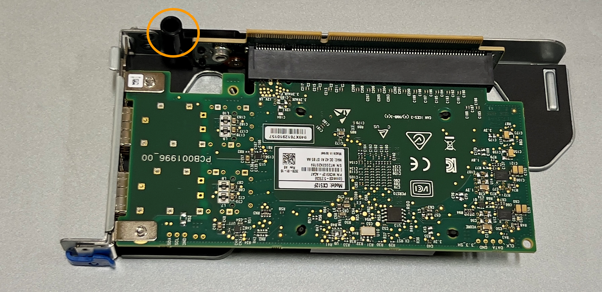
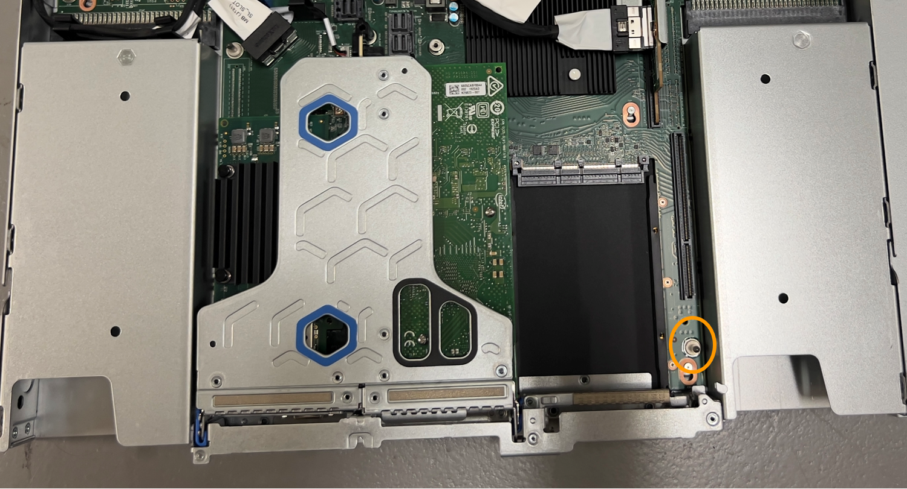

= 更換 SGF6112 中的 NIC
:allow-uri-read: 
:icons: font
:imagesdir: ../media/

[role="lead"]
如果 SGF6112 中的網路介面卡（ NIC ）無法正常運作或故障、您可能需要更換該卡。

請使用下列程序：

* 移除 NIC
* 重新安裝 NIC

== 移除 NIC

.開始之前
* 您擁有正確的替換 NIC 。
* 您已確定要更換的 NIC 的位置。
+
link:verify-component-to-replace.html["確認要更換的元件位置"]

* 您已實際找到 SGF6112 應用裝置、以便在其中更換資料中心的 NIC 。
+
link:locating-sgf6112-in-data-center.html["在資料中心找到應用裝置"]

+

NOTE: 答 link:shut-down-sgf6112.html["受控制的產品關機"] 從機架中取出產品之前、必須先完成此步驟。

* 您已拔下所有纜線、並取下產品外蓋。
+
link:reinstalling-sgf6112-cover.html["卸下 SGF6112 護蓋"]

.關於這項工作
為避免服務中斷、請確認所有其他儲存節點都已連線至網格、然後再開始更換網路介面卡（ NIC ）、或在正常預期服務中斷期間、於排程的維護期間更換 NIC 。請參閱相關資訊 link:../monitor/monitoring-system-health.html#monitor-node-connection-states["監控節點連線狀態"]。

IMPORTANT: 如果您曾經使用過僅建立一個物件複本的 ILM 規則、則必須在排程維護期間更換 NIC 。否則、在此程序期間、您可能會暫時失去對這些物件的存取權。請參閱相關資訊 link:../ilm/why-you-should-not-use-single-copy-replication.html["為何不應使用單一複本複寫"]。

.步驟
. 將防靜電腕帶的綁帶末端包覆在您的腕帶上、並將扣夾末端固定在金屬接地上、以避免產生靜電。
. 找到設備背面包含 NIC 的擴充卡組件。
+
SGF6112 中的三個 NIC 位於機箱中的兩個立管組件中（圖中所示爲 SGF6112 的背面，上面的頂蓋已卸下）：

+
image::../media/sgf6112-nic-positions.jpg[NIC 位置]

[cols="1a,2a,4a"]
|===
|  | 裝置或零件名稱 | 說明 

 a| 
1.
 a| 
Hic1/hic2
 a| 
雙埠擴充卡組件中的 10/25-GbE 乙太網路連接埠

 a| 
2.
 a| 
mtc1/MTC2
 a| 
雙埠擴充卡組件中的 1/10GBase-T 管理連接埠

 a| 
3.
 a| 
Hic3/hic4
 a| 
單埠擴充卡組件中的 10/25-GbE 乙太網路連接埠

 a| 
4.
 a| 
雙插槽擴充卡組件
 a| 
支援 10/25-GbE NIC 和 1/10GBase-T NIC 之一

 a| 
5.
 a| 
單插槽擴充卡組件
 a| 
支援其中一個 10/25-GbE NIC

|===
. 抓住有故障 NIC 的轉接器組件、將其穿過藍色標記的孔洞、然後小心地將其向上提起。將提升板部件向機箱正面移動，以便將其安裝的 NIC 中的外部連接器清空機箱。
. 將擴充卡放在平坦的防靜電表面上、金屬框架側朝下、即可存取 NIC 。
+
** * 雙插槽擴充卡組件，含兩個 NIC*
+
image::../media/two-slot-assembly-sgf6112.png[SGF6112 雙插槽擴充卡組件中有兩個 NIC]

** * 一個帶有一個 NIC* 的單插槽提升板部件
+
image::../media/one-slot-assembly-sgf6112.png[單插槽提升板組件中的 SGF6112 NIC]

. 打開要更換的 NIC 上的藍色閂鎖（圓圈）、然後小心地將 NIC 從提升板組件中卸下。輕輕搖晃 NIC 、以協助將 NIC 從連接器中移除。請勿過度施力。
. 將 NIC 放置在平坦的防靜電表面上。

== 重新安裝 NIC

將更換的 NIC 安裝到與移除的 NIC 相同的位置。

.開始之前
* 您擁有正確的替換 NIC 。
* 您已移除現有的故障 NIC 。

.步驟
. 將防靜電腕帶的綁帶末端包覆在您的腕帶上、並將扣夾末端固定在金屬接地上、以避免產生靜電。
. 從包裝中取出更換的 NIC 。
. 如果您要更換雙插槽擴充卡組件中的其中一個 NIC 、請執行下列步驟：
+
.. 確定藍色栓鎖處於開啟位置。
.. 將 NIC 與其擴充卡組件上的連接器對齊。小心地將 NIC 按入連接器、直到完全就位、如圖所示、然後關閉藍色閂鎖。
+
image::../media/two-slot-assembly-sgf6112.png[SGF6112 雙插槽擴充卡組件中有兩個 NIC]

.. 找到雙插槽擴充卡組件（圈選）上的定位孔、使其與主機板上的導引插針對齊、以確保正確放置擴充卡組件。
+
image::../media/sgf6112_two-slot-riser_alignment_hole.png[SGF6112 大型擴充卡組件上的定位孔]

.. 找到主機板上的導引針
+
image::../media/sgf6112_two-slot-riser_guide-pin.png[SGF6112 上的導引插腳、用於雙插槽擴充卡組件]

.. 將轉接器組件放入機箱中、確定其對齊主機板上的連接器和導引針。
.. 小心地沿著藍色標記的孔洞旁的中心線、將雙插槽立管組件按入定位、直到完全就位。

. 如果您要更換單插槽擴充卡組件中的 NIC 、請執行下列步驟：
+
.. 確定藍色栓鎖處於開啟位置。
.. 將 NIC 與其擴充卡組件上的連接器對齊。小心地將 NIC 按入連接器、直到完全就位、如圖所示、然後關閉藍色閂鎖。
+
image::../media/one-slot-assembly-sgf6112.png[單插槽提升板組件中 NIC 上的 SGF6112]

.. 找到單插槽提升板組件（圈選）上的定位孔、使其與主機板上的導引插針對齊、以確保提升板組件正確定位。
+

.. 找到主機板上的導引針
+

.. 將單插槽擴充卡組件放在機箱中、確定它與主機板上的連接器和導引針對齊。
.. 小心地沿著藍色標記的孔洞旁的中心線將單槽式立管組件按入定位、直到完全就位。

. 從要重新安裝纜線的 NIC 連接埠取下保護蓋。

.完成後
如果您沒有其他維護程序可以在產品中執行、請重新安裝產品護蓋、將產品放回機架、連接纜線並接上電源。

更換零件後、請將故障零件歸還給NetApp、如套件隨附的RMA指示所述。請參閱 https://mysupport.netapp.com/site/info/rma["產品退貨安培；更換"^] 頁面以取得更多資訊。
