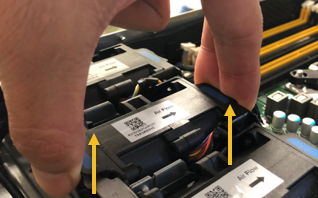
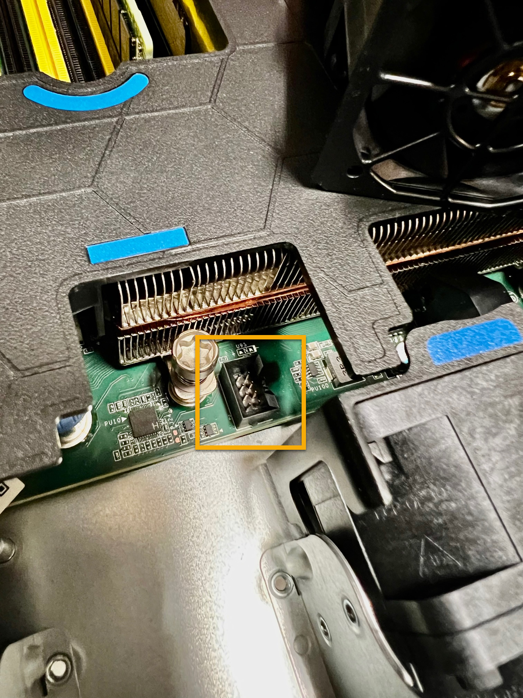

= 更換 SGF6112 產品中的風扇
:allow-uri-read: 
:icons: font
:imagesdir: ../media/

[role="lead"]
SGF6112 產品具有八個冷卻風扇。如果其中一個風扇故障、您必須儘快更換、以確保產品具有適當的冷卻效果。

.開始之前
* 您擁有正確的更換風扇。
* 您已確定要更換風扇的位置。
+
link:verify-component-to-replace.html["確認要更換的元件"]

* 您已實際找到 SGF6112 應用裝置、以便在其中更換資料中心的風扇。
+
link:locating-sgf6112-in-data-center.html["在資料中心找到應用裝置"]

+

NOTE: 答 link:shut-down-sgf6112.html["受控制的產品關機"] 從機架中取出產品之前、必須先完成此步驟。

* 您已拔下所有纜線、並取下產品外蓋。
+
link:reinstalling-sgf6112-cover.html["卸下 SGF6112 護蓋"]

* 您已確認其他風扇已安裝並執行。

.關於這項工作
為避免服務中斷、請確認所有其他儲存節點均已連接至網格、然後在正常預期服務中斷期間、於排程維護期間開始更換風扇或更換風扇。請參閱相關資訊 link:../monitor/monitoring-system-health.html#monitor-node-connection-states["監控節點連線狀態"]。

IMPORTANT: 如果您曾經使用過僅建立一個物件複本的 ILM 規則、則必須在排程維護期間更換風扇。否則、在此程序期間、您可能會暫時失去對這些物件的存取權。請參閱相關資訊 link:../ilm/why-you-should-not-use-single-copy-replication.html["為何不應使用單一複本複寫"]。

更換風扇時、無法存取應用裝置節點。

相片顯示產品的風扇。電子接頭會反白顯示。將產品的頂蓋從產品上卸下後、即可接觸到冷卻風扇。

NOTE: 兩個電源供應器單元中的每個單元都有一個風扇。此程序不包含電源供應器風扇。

image::../media/sgf6112_fan_fru.png[風扇 SGF6112 FRU]

.步驟
. 將防靜電腕帶的綁帶末端包覆在您的腕帶上、並將扣夾末端固定在金屬接地上、以避免產生靜電。
. 找到您需要更換的風扇。
+
機箱中的八個風扇位於以下位置（圖示爲 SGF6112 的前半部分，其中卸下了頂蓋）：

+
image::../media/SGF6112-fan-locations.png[風扇位置]

|===

|  | 風扇單元 

 a| 
1.
 a| 
FAN_SYS0

 a| 
2.
 a| 
FAN_SYS1

 a| 
3.
 a| 
FAN_SYS2

 a| 
4.
 a| 
FAN_SYS3

 a| 
5.
 a| 
FAN_SYS4

 a| 
6.
 a| 
FAN_SYS5

 a| 
7.
 a| 
FAN_SYS6

 a| 
8.
 a| 
FAN_SYS7

|===
. 使用風扇上的藍色彈片、將故障風扇從機箱中提出。
+

. 將替換風扇滑入機箱的開放式插槽。
+
請務必將風扇上的連接器與電路板上的插槽對齊。

. 將風扇的接頭穩固地按入電路板（突出顯示插槽）。
+

. 將頂蓋裝回產品上、然後按下栓鎖、將護蓋固定到位。
. 開啟產品電源、並監控應用裝置LED和開機代碼。
+
使用BMC介面來監控開機狀態。

. 確認應用裝置節點出現在Grid Manager中、且未顯示任何警示。

更換零件後、請將故障零件歸還給NetApp、如套件隨附的RMA指示所述。請參閱 https://["產品退貨安培；更換"^] 頁面以取得更多資訊。
